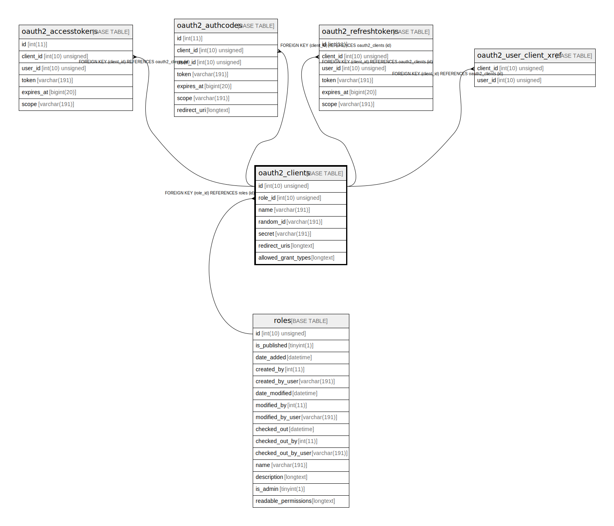

# oauth2_clients

## Description

<details>
<summary><strong>Table Definition</strong></summary>

```sql
CREATE TABLE `oauth2_clients` (
  `id` int(10) unsigned NOT NULL AUTO_INCREMENT,
  `role_id` int(10) unsigned DEFAULT NULL,
  `name` varchar(191) COLLATE utf8mb4_unicode_ci NOT NULL,
  `random_id` varchar(191) COLLATE utf8mb4_unicode_ci NOT NULL,
  `secret` varchar(191) COLLATE utf8mb4_unicode_ci NOT NULL,
  `redirect_uris` longtext COLLATE utf8mb4_unicode_ci NOT NULL COMMENT '(DC2Type:array)',
  `allowed_grant_types` longtext COLLATE utf8mb4_unicode_ci NOT NULL COMMENT '(DC2Type:array)',
  PRIMARY KEY (`id`),
  KEY `IDX_F9D02AE6D60322AC` (`role_id`),
  KEY `client_id_search` (`random_id`),
  CONSTRAINT `FK_F9D02AE6D60322AC` FOREIGN KEY (`role_id`) REFERENCES `roles` (`id`)
) ENGINE=InnoDB DEFAULT CHARSET=utf8mb4 COLLATE=utf8mb4_unicode_ci ROW_FORMAT=DYNAMIC
```

</details>

## Columns

| Name | Type | Default | Nullable | Extra Definition | Children | Parents | Comment |
| ---- | ---- | ------- | -------- | --------------- | -------- | ------- | ------- |
| id | int(10) unsigned |  | false | auto_increment | [oauth2_accesstokens](oauth2_accesstokens.md) [oauth2_authcodes](oauth2_authcodes.md) [oauth2_refreshtokens](oauth2_refreshtokens.md) [oauth2_user_client_xref](oauth2_user_client_xref.md) |  |  |
| role_id | int(10) unsigned | NULL | true |  |  | [roles](roles.md) |  |
| name | varchar(191) |  | false |  |  |  |  |
| random_id | varchar(191) |  | false |  |  |  |  |
| secret | varchar(191) |  | false |  |  |  |  |
| redirect_uris | longtext |  | false |  |  |  | (DC2Type:array) |
| allowed_grant_types | longtext |  | false |  |  |  | (DC2Type:array) |

## Constraints

| Name | Type | Definition |
| ---- | ---- | ---------- |
| FK_F9D02AE6D60322AC | FOREIGN KEY | FOREIGN KEY (role_id) REFERENCES roles (id) |
| PRIMARY | PRIMARY KEY | PRIMARY KEY (id) |

## Indexes

| Name | Definition |
| ---- | ---------- |
| client_id_search | KEY client_id_search (random_id) USING BTREE |
| IDX_F9D02AE6D60322AC | KEY IDX_F9D02AE6D60322AC (role_id) USING BTREE |
| PRIMARY | PRIMARY KEY (id) USING BTREE |

## Relations



---

> Generated by [tbls](https://github.com/k1LoW/tbls)
