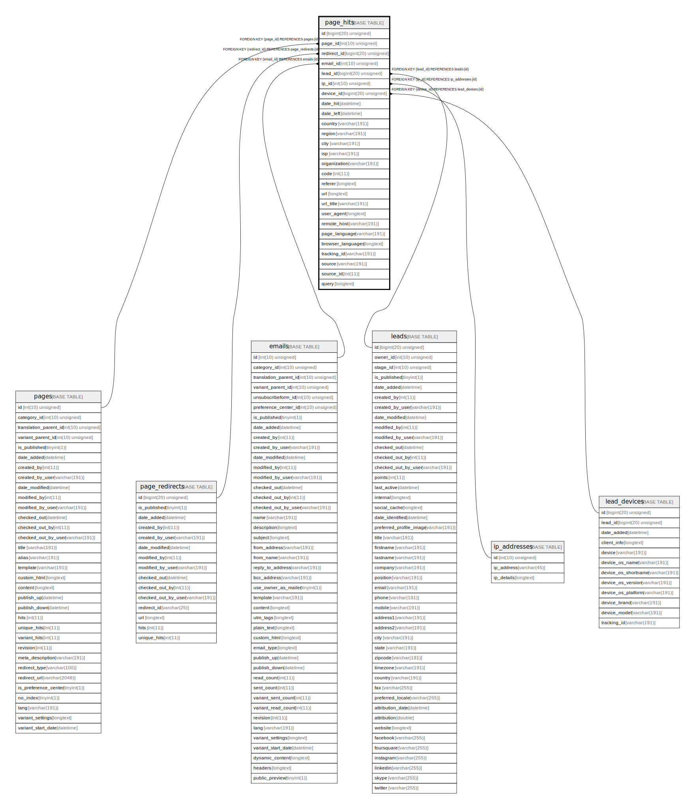

# page_hits

## Description

<details>
<summary><strong>Table Definition</strong></summary>

```sql
CREATE TABLE `page_hits` (
  `id` bigint(20) unsigned NOT NULL AUTO_INCREMENT,
  `page_id` int(10) unsigned DEFAULT NULL,
  `redirect_id` bigint(20) unsigned DEFAULT NULL,
  `email_id` int(10) unsigned DEFAULT NULL,
  `lead_id` bigint(20) unsigned DEFAULT NULL,
  `ip_id` int(10) unsigned NOT NULL,
  `device_id` bigint(20) unsigned DEFAULT NULL,
  `date_hit` datetime NOT NULL,
  `date_left` datetime DEFAULT NULL,
  `country` varchar(191) COLLATE utf8mb4_unicode_ci DEFAULT NULL,
  `region` varchar(191) COLLATE utf8mb4_unicode_ci DEFAULT NULL,
  `city` varchar(191) COLLATE utf8mb4_unicode_ci DEFAULT NULL,
  `isp` varchar(191) COLLATE utf8mb4_unicode_ci DEFAULT NULL,
  `organization` varchar(191) COLLATE utf8mb4_unicode_ci DEFAULT NULL,
  `code` int(11) NOT NULL,
  `referer` longtext COLLATE utf8mb4_unicode_ci DEFAULT NULL,
  `url` longtext COLLATE utf8mb4_unicode_ci DEFAULT NULL,
  `url_title` varchar(191) COLLATE utf8mb4_unicode_ci DEFAULT NULL,
  `user_agent` longtext COLLATE utf8mb4_unicode_ci DEFAULT NULL,
  `remote_host` varchar(191) COLLATE utf8mb4_unicode_ci DEFAULT NULL,
  `page_language` varchar(191) COLLATE utf8mb4_unicode_ci DEFAULT NULL,
  `browser_languages` longtext COLLATE utf8mb4_unicode_ci DEFAULT NULL COMMENT '(DC2Type:array)',
  `tracking_id` varchar(191) COLLATE utf8mb4_unicode_ci NOT NULL,
  `source` varchar(191) COLLATE utf8mb4_unicode_ci DEFAULT NULL,
  `source_id` int(11) DEFAULT NULL,
  `query` longtext COLLATE utf8mb4_unicode_ci DEFAULT NULL COMMENT '(DC2Type:array)',
  PRIMARY KEY (`id`),
  KEY `IDX_9D4B70F1C4663E4` (`page_id`),
  KEY `IDX_9D4B70F1B42D874D` (`redirect_id`),
  KEY `IDX_9D4B70F1A832C1C9` (`email_id`),
  KEY `IDX_9D4B70F155458D` (`lead_id`),
  KEY `IDX_9D4B70F1A03F5E9F` (`ip_id`),
  KEY `IDX_9D4B70F194A4C7D4` (`device_id`),
  KEY `page_hit_tracking_search` (`tracking_id`),
  KEY `page_hit_code_search` (`code`),
  KEY `page_hit_source_search` (`source`,`source_id`),
  KEY `date_hit_left_index` (`date_hit`,`date_left`),
  KEY `page_hit_url` (`url`(128)),
  CONSTRAINT `FK_9D4B70F155458D` FOREIGN KEY (`lead_id`) REFERENCES `leads` (`id`) ON DELETE SET NULL,
  CONSTRAINT `FK_9D4B70F194A4C7D4` FOREIGN KEY (`device_id`) REFERENCES `lead_devices` (`id`) ON DELETE SET NULL,
  CONSTRAINT `FK_9D4B70F1A03F5E9F` FOREIGN KEY (`ip_id`) REFERENCES `ip_addresses` (`id`),
  CONSTRAINT `FK_9D4B70F1A832C1C9` FOREIGN KEY (`email_id`) REFERENCES `emails` (`id`) ON DELETE SET NULL,
  CONSTRAINT `FK_9D4B70F1B42D874D` FOREIGN KEY (`redirect_id`) REFERENCES `page_redirects` (`id`) ON DELETE SET NULL,
  CONSTRAINT `FK_9D4B70F1C4663E4` FOREIGN KEY (`page_id`) REFERENCES `pages` (`id`) ON DELETE SET NULL
) ENGINE=InnoDB DEFAULT CHARSET=utf8mb4 COLLATE=utf8mb4_unicode_ci ROW_FORMAT=DYNAMIC
```

</details>

## Columns

| Name | Type | Default | Nullable | Extra Definition | Children | Parents | Comment |
| ---- | ---- | ------- | -------- | --------------- | -------- | ------- | ------- |
| id | bigint(20) unsigned |  | false | auto_increment |  |  |  |
| page_id | int(10) unsigned | NULL | true |  |  | [pages](pages.md) |  |
| redirect_id | bigint(20) unsigned | NULL | true |  |  | [page_redirects](page_redirects.md) |  |
| email_id | int(10) unsigned | NULL | true |  |  | [emails](emails.md) |  |
| lead_id | bigint(20) unsigned | NULL | true |  |  | [leads](leads.md) |  |
| ip_id | int(10) unsigned |  | false |  |  | [ip_addresses](ip_addresses.md) |  |
| device_id | bigint(20) unsigned | NULL | true |  |  | [lead_devices](lead_devices.md) |  |
| date_hit | datetime |  | false |  |  |  |  |
| date_left | datetime | NULL | true |  |  |  |  |
| country | varchar(191) | NULL | true |  |  |  |  |
| region | varchar(191) | NULL | true |  |  |  |  |
| city | varchar(191) | NULL | true |  |  |  |  |
| isp | varchar(191) | NULL | true |  |  |  |  |
| organization | varchar(191) | NULL | true |  |  |  |  |
| code | int(11) |  | false |  |  |  |  |
| referer | longtext | NULL | true |  |  |  |  |
| url | longtext | NULL | true |  |  |  |  |
| url_title | varchar(191) | NULL | true |  |  |  |  |
| user_agent | longtext | NULL | true |  |  |  |  |
| remote_host | varchar(191) | NULL | true |  |  |  |  |
| page_language | varchar(191) | NULL | true |  |  |  |  |
| browser_languages | longtext | NULL | true |  |  |  | (DC2Type:array) |
| tracking_id | varchar(191) |  | false |  |  |  |  |
| source | varchar(191) | NULL | true |  |  |  |  |
| source_id | int(11) | NULL | true |  |  |  |  |
| query | longtext | NULL | true |  |  |  | (DC2Type:array) |

## Constraints

| Name | Type | Definition |
| ---- | ---- | ---------- |
| FK_9D4B70F155458D | FOREIGN KEY | FOREIGN KEY (lead_id) REFERENCES leads (id) |
| FK_9D4B70F194A4C7D4 | FOREIGN KEY | FOREIGN KEY (device_id) REFERENCES lead_devices (id) |
| FK_9D4B70F1A03F5E9F | FOREIGN KEY | FOREIGN KEY (ip_id) REFERENCES ip_addresses (id) |
| FK_9D4B70F1A832C1C9 | FOREIGN KEY | FOREIGN KEY (email_id) REFERENCES emails (id) |
| FK_9D4B70F1B42D874D | FOREIGN KEY | FOREIGN KEY (redirect_id) REFERENCES page_redirects (id) |
| FK_9D4B70F1C4663E4 | FOREIGN KEY | FOREIGN KEY (page_id) REFERENCES pages (id) |
| PRIMARY | PRIMARY KEY | PRIMARY KEY (id) |

## Indexes

| Name | Definition |
| ---- | ---------- |
| date_hit_left_index | KEY date_hit_left_index (date_hit, date_left) USING BTREE |
| IDX_9D4B70F155458D | KEY IDX_9D4B70F155458D (lead_id) USING BTREE |
| IDX_9D4B70F194A4C7D4 | KEY IDX_9D4B70F194A4C7D4 (device_id) USING BTREE |
| IDX_9D4B70F1A03F5E9F | KEY IDX_9D4B70F1A03F5E9F (ip_id) USING BTREE |
| IDX_9D4B70F1A832C1C9 | KEY IDX_9D4B70F1A832C1C9 (email_id) USING BTREE |
| IDX_9D4B70F1B42D874D | KEY IDX_9D4B70F1B42D874D (redirect_id) USING BTREE |
| IDX_9D4B70F1C4663E4 | KEY IDX_9D4B70F1C4663E4 (page_id) USING BTREE |
| page_hit_code_search | KEY page_hit_code_search (code) USING BTREE |
| page_hit_source_search | KEY page_hit_source_search (source, source_id) USING BTREE |
| page_hit_tracking_search | KEY page_hit_tracking_search (tracking_id) USING BTREE |
| page_hit_url | KEY page_hit_url (url) USING BTREE |
| PRIMARY | PRIMARY KEY (id) USING BTREE |

## Relations



---

> Generated by [tbls](https://github.com/k1LoW/tbls)
