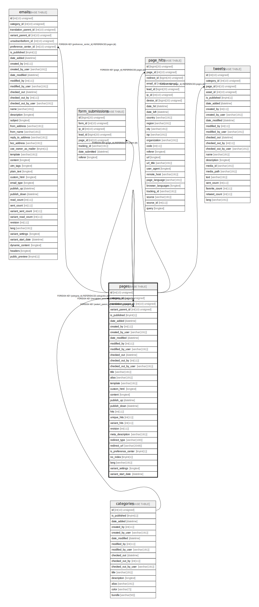

# pages

## Description

<details>
<summary><strong>Table Definition</strong></summary>

```sql
CREATE TABLE `pages` (
  `id` int(10) unsigned NOT NULL AUTO_INCREMENT,
  `category_id` int(10) unsigned DEFAULT NULL,
  `translation_parent_id` int(10) unsigned DEFAULT NULL,
  `variant_parent_id` int(10) unsigned DEFAULT NULL,
  `is_published` tinyint(1) NOT NULL,
  `date_added` datetime DEFAULT NULL,
  `created_by` int(11) DEFAULT NULL,
  `created_by_user` varchar(191) COLLATE utf8mb4_unicode_ci DEFAULT NULL,
  `date_modified` datetime DEFAULT NULL,
  `modified_by` int(11) DEFAULT NULL,
  `modified_by_user` varchar(191) COLLATE utf8mb4_unicode_ci DEFAULT NULL,
  `checked_out` datetime DEFAULT NULL,
  `checked_out_by` int(11) DEFAULT NULL,
  `checked_out_by_user` varchar(191) COLLATE utf8mb4_unicode_ci DEFAULT NULL,
  `title` varchar(191) COLLATE utf8mb4_unicode_ci NOT NULL,
  `alias` varchar(191) COLLATE utf8mb4_unicode_ci NOT NULL,
  `template` varchar(191) COLLATE utf8mb4_unicode_ci DEFAULT NULL,
  `custom_html` longtext COLLATE utf8mb4_unicode_ci DEFAULT NULL,
  `content` longtext COLLATE utf8mb4_unicode_ci DEFAULT NULL COMMENT '(DC2Type:array)',
  `publish_up` datetime DEFAULT NULL,
  `publish_down` datetime DEFAULT NULL,
  `hits` int(11) NOT NULL,
  `unique_hits` int(11) NOT NULL,
  `variant_hits` int(11) NOT NULL,
  `revision` int(11) NOT NULL,
  `meta_description` varchar(191) COLLATE utf8mb4_unicode_ci DEFAULT NULL,
  `redirect_type` varchar(100) COLLATE utf8mb4_unicode_ci DEFAULT NULL,
  `redirect_url` varchar(2048) COLLATE utf8mb4_unicode_ci DEFAULT NULL,
  `is_preference_center` tinyint(1) DEFAULT NULL,
  `no_index` tinyint(1) DEFAULT NULL,
  `lang` varchar(191) COLLATE utf8mb4_unicode_ci NOT NULL,
  `variant_settings` longtext COLLATE utf8mb4_unicode_ci DEFAULT NULL COMMENT '(DC2Type:array)',
  `variant_start_date` datetime DEFAULT NULL,
  PRIMARY KEY (`id`),
  KEY `IDX_2074E57512469DE2` (`category_id`),
  KEY `IDX_2074E5759091A2FB` (`translation_parent_id`),
  KEY `IDX_2074E57591861123` (`variant_parent_id`),
  KEY `page_alias_search` (`alias`),
  CONSTRAINT `FK_2074E57512469DE2` FOREIGN KEY (`category_id`) REFERENCES `categories` (`id`) ON DELETE SET NULL,
  CONSTRAINT `FK_2074E5759091A2FB` FOREIGN KEY (`translation_parent_id`) REFERENCES `pages` (`id`) ON DELETE CASCADE,
  CONSTRAINT `FK_2074E57591861123` FOREIGN KEY (`variant_parent_id`) REFERENCES `pages` (`id`) ON DELETE CASCADE
) ENGINE=InnoDB DEFAULT CHARSET=utf8mb4 COLLATE=utf8mb4_unicode_ci ROW_FORMAT=DYNAMIC
```

</details>

## Columns

| Name | Type | Default | Nullable | Extra Definition | Children | Parents | Comment |
| ---- | ---- | ------- | -------- | --------------- | -------- | ------- | ------- |
| id | int(10) unsigned |  | false | auto_increment | [emails](emails.md) [form_submissions](form_submissions.md) [pages](pages.md) [page_hits](page_hits.md) [tweets](tweets.md) |  |  |
| category_id | int(10) unsigned | NULL | true |  |  | [categories](categories.md) |  |
| translation_parent_id | int(10) unsigned | NULL | true |  |  | [pages](pages.md) |  |
| variant_parent_id | int(10) unsigned | NULL | true |  |  | [pages](pages.md) |  |
| is_published | tinyint(1) |  | false |  |  |  |  |
| date_added | datetime | NULL | true |  |  |  |  |
| created_by | int(11) | NULL | true |  |  |  |  |
| created_by_user | varchar(191) | NULL | true |  |  |  |  |
| date_modified | datetime | NULL | true |  |  |  |  |
| modified_by | int(11) | NULL | true |  |  |  |  |
| modified_by_user | varchar(191) | NULL | true |  |  |  |  |
| checked_out | datetime | NULL | true |  |  |  |  |
| checked_out_by | int(11) | NULL | true |  |  |  |  |
| checked_out_by_user | varchar(191) | NULL | true |  |  |  |  |
| title | varchar(191) |  | false |  |  |  |  |
| alias | varchar(191) |  | false |  |  |  |  |
| template | varchar(191) | NULL | true |  |  |  |  |
| custom_html | longtext | NULL | true |  |  |  |  |
| content | longtext | NULL | true |  |  |  | (DC2Type:array) |
| publish_up | datetime | NULL | true |  |  |  |  |
| publish_down | datetime | NULL | true |  |  |  |  |
| hits | int(11) |  | false |  |  |  |  |
| unique_hits | int(11) |  | false |  |  |  |  |
| variant_hits | int(11) |  | false |  |  |  |  |
| revision | int(11) |  | false |  |  |  |  |
| meta_description | varchar(191) | NULL | true |  |  |  |  |
| redirect_type | varchar(100) | NULL | true |  |  |  |  |
| redirect_url | varchar(2048) | NULL | true |  |  |  |  |
| is_preference_center | tinyint(1) | NULL | true |  |  |  |  |
| no_index | tinyint(1) | NULL | true |  |  |  |  |
| lang | varchar(191) |  | false |  |  |  |  |
| variant_settings | longtext | NULL | true |  |  |  | (DC2Type:array) |
| variant_start_date | datetime | NULL | true |  |  |  |  |

## Constraints

| Name | Type | Definition |
| ---- | ---- | ---------- |
| FK_2074E57512469DE2 | FOREIGN KEY | FOREIGN KEY (category_id) REFERENCES categories (id) |
| FK_2074E5759091A2FB | FOREIGN KEY | FOREIGN KEY (translation_parent_id) REFERENCES pages (id) |
| FK_2074E57591861123 | FOREIGN KEY | FOREIGN KEY (variant_parent_id) REFERENCES pages (id) |
| PRIMARY | PRIMARY KEY | PRIMARY KEY (id) |

## Indexes

| Name | Definition |
| ---- | ---------- |
| IDX_2074E57512469DE2 | KEY IDX_2074E57512469DE2 (category_id) USING BTREE |
| IDX_2074E5759091A2FB | KEY IDX_2074E5759091A2FB (translation_parent_id) USING BTREE |
| IDX_2074E57591861123 | KEY IDX_2074E57591861123 (variant_parent_id) USING BTREE |
| page_alias_search | KEY page_alias_search (alias) USING BTREE |
| PRIMARY | PRIMARY KEY (id) USING BTREE |

## Relations



---

> Generated by [tbls](https://github.com/k1LoW/tbls)
