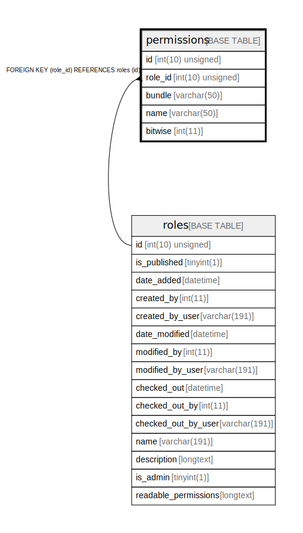

# permissions

## Description

<details>
<summary><strong>Table Definition</strong></summary>

```sql
CREATE TABLE `permissions` (
  `id` int(10) unsigned NOT NULL AUTO_INCREMENT,
  `role_id` int(10) unsigned NOT NULL,
  `bundle` varchar(50) COLLATE utf8mb4_unicode_ci NOT NULL,
  `name` varchar(50) COLLATE utf8mb4_unicode_ci NOT NULL,
  `bitwise` int(11) NOT NULL,
  PRIMARY KEY (`id`),
  UNIQUE KEY `unique_perm` (`bundle`,`name`,`role_id`),
  KEY `IDX_2DEDCC6FD60322AC` (`role_id`),
  CONSTRAINT `FK_2DEDCC6FD60322AC` FOREIGN KEY (`role_id`) REFERENCES `roles` (`id`) ON DELETE CASCADE
) ENGINE=InnoDB DEFAULT CHARSET=utf8mb4 COLLATE=utf8mb4_unicode_ci ROW_FORMAT=DYNAMIC
```

</details>

## Columns

| Name | Type | Default | Nullable | Extra Definition | Children | Parents | Comment |
| ---- | ---- | ------- | -------- | --------------- | -------- | ------- | ------- |
| id | int(10) unsigned |  | false | auto_increment |  |  |  |
| role_id | int(10) unsigned |  | false |  |  | [roles](roles.md) |  |
| bundle | varchar(50) |  | false |  |  |  |  |
| name | varchar(50) |  | false |  |  |  |  |
| bitwise | int(11) |  | false |  |  |  |  |

## Constraints

| Name | Type | Definition |
| ---- | ---- | ---------- |
| FK_2DEDCC6FD60322AC | FOREIGN KEY | FOREIGN KEY (role_id) REFERENCES roles (id) |
| PRIMARY | PRIMARY KEY | PRIMARY KEY (id) |
| unique_perm | UNIQUE | UNIQUE KEY unique_perm (bundle, name, role_id) |

## Indexes

| Name | Definition |
| ---- | ---------- |
| IDX_2DEDCC6FD60322AC | KEY IDX_2DEDCC6FD60322AC (role_id) USING BTREE |
| PRIMARY | PRIMARY KEY (id) USING BTREE |
| unique_perm | UNIQUE KEY unique_perm (bundle, name, role_id) USING BTREE |

## Relations



---

> Generated by [tbls](https://github.com/k1LoW/tbls)
