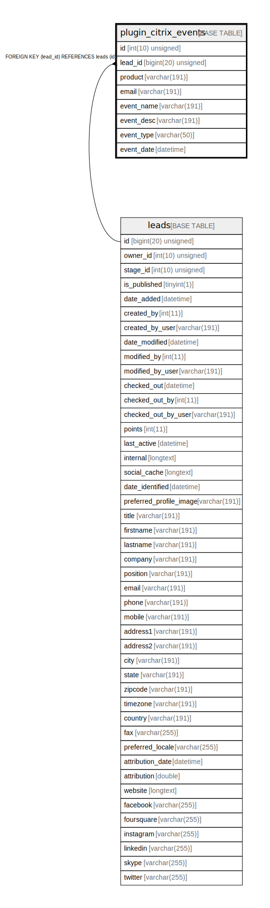

# plugin_citrix_events

## Description

<details>
<summary><strong>Table Definition</strong></summary>

```sql
CREATE TABLE `plugin_citrix_events` (
  `id` int(10) unsigned NOT NULL AUTO_INCREMENT,
  `lead_id` bigint(20) unsigned NOT NULL,
  `product` varchar(191) COLLATE utf8mb4_unicode_ci NOT NULL,
  `email` varchar(191) COLLATE utf8mb4_unicode_ci NOT NULL,
  `event_name` varchar(191) COLLATE utf8mb4_unicode_ci NOT NULL,
  `event_desc` varchar(191) COLLATE utf8mb4_unicode_ci DEFAULT NULL,
  `event_type` varchar(50) COLLATE utf8mb4_unicode_ci NOT NULL,
  `event_date` datetime NOT NULL,
  PRIMARY KEY (`id`),
  KEY `IDX_D77731055458D` (`lead_id`),
  KEY `citrix_event_email` (`product`,`email`),
  KEY `citrix_event_name` (`product`,`event_name`,`event_type`),
  KEY `citrix_event_type` (`product`,`event_type`,`event_date`),
  KEY `citrix_event_product` (`product`,`email`,`event_type`),
  KEY `citrix_event_product_name` (`product`,`email`,`event_type`,`event_name`),
  KEY `citrix_event_product_name_lead` (`product`,`event_type`,`event_name`,`lead_id`),
  KEY `citrix_event_product_type_lead` (`product`,`event_type`,`lead_id`),
  KEY `citrix_event_date` (`event_date`),
  CONSTRAINT `FK_D77731055458D` FOREIGN KEY (`lead_id`) REFERENCES `leads` (`id`) ON DELETE CASCADE
) ENGINE=InnoDB DEFAULT CHARSET=utf8mb4 COLLATE=utf8mb4_unicode_ci ROW_FORMAT=DYNAMIC
```

</details>

## Columns

| Name | Type | Default | Nullable | Extra Definition | Children | Parents | Comment |
| ---- | ---- | ------- | -------- | --------------- | -------- | ------- | ------- |
| id | int(10) unsigned |  | false | auto_increment |  |  |  |
| lead_id | bigint(20) unsigned |  | false |  |  | [leads](leads.md) |  |
| product | varchar(191) |  | false |  |  |  |  |
| email | varchar(191) |  | false |  |  |  |  |
| event_name | varchar(191) |  | false |  |  |  |  |
| event_desc | varchar(191) | NULL | true |  |  |  |  |
| event_type | varchar(50) |  | false |  |  |  |  |
| event_date | datetime |  | false |  |  |  |  |

## Constraints

| Name | Type | Definition |
| ---- | ---- | ---------- |
| FK_D77731055458D | FOREIGN KEY | FOREIGN KEY (lead_id) REFERENCES leads (id) |
| PRIMARY | PRIMARY KEY | PRIMARY KEY (id) |

## Indexes

| Name | Definition |
| ---- | ---------- |
| citrix_event_date | KEY citrix_event_date (event_date) USING BTREE |
| citrix_event_email | KEY citrix_event_email (product, email) USING BTREE |
| citrix_event_name | KEY citrix_event_name (product, event_name, event_type) USING BTREE |
| citrix_event_product | KEY citrix_event_product (product, email, event_type) USING BTREE |
| citrix_event_product_name | KEY citrix_event_product_name (product, email, event_type, event_name) USING BTREE |
| citrix_event_product_name_lead | KEY citrix_event_product_name_lead (product, event_type, event_name, lead_id) USING BTREE |
| citrix_event_product_type_lead | KEY citrix_event_product_type_lead (product, event_type, lead_id) USING BTREE |
| citrix_event_type | KEY citrix_event_type (product, event_type, event_date) USING BTREE |
| IDX_D77731055458D | KEY IDX_D77731055458D (lead_id) USING BTREE |
| PRIMARY | PRIMARY KEY (id) USING BTREE |

## Relations



---

> Generated by [tbls](https://github.com/k1LoW/tbls)
