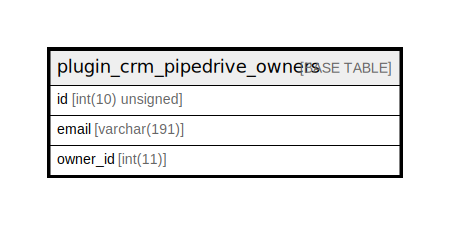

# plugin_crm_pipedrive_owners

## Description

<details>
<summary><strong>Table Definition</strong></summary>

```sql
CREATE TABLE `plugin_crm_pipedrive_owners` (
  `id` int(10) unsigned NOT NULL AUTO_INCREMENT,
  `email` varchar(191) COLLATE utf8mb4_unicode_ci NOT NULL,
  `owner_id` int(11) DEFAULT NULL,
  PRIMARY KEY (`id`),
  KEY `email` (`email`),
  KEY `owner_id` (`owner_id`)
) ENGINE=InnoDB DEFAULT CHARSET=utf8mb4 COLLATE=utf8mb4_unicode_ci ROW_FORMAT=DYNAMIC
```

</details>

## Columns

| Name | Type | Default | Nullable | Extra Definition | Children | Parents | Comment |
| ---- | ---- | ------- | -------- | --------------- | -------- | ------- | ------- |
| id | int(10) unsigned |  | false | auto_increment |  |  |  |
| email | varchar(191) |  | false |  |  |  |  |
| owner_id | int(11) | NULL | true |  |  |  |  |

## Constraints

| Name | Type | Definition |
| ---- | ---- | ---------- |
| PRIMARY | PRIMARY KEY | PRIMARY KEY (id) |

## Indexes

| Name | Definition |
| ---- | ---------- |
| email | KEY email (email) USING BTREE |
| owner_id | KEY owner_id (owner_id) USING BTREE |
| PRIMARY | PRIMARY KEY (id) USING BTREE |

## Relations



---

> Generated by [tbls](https://github.com/k1LoW/tbls)
