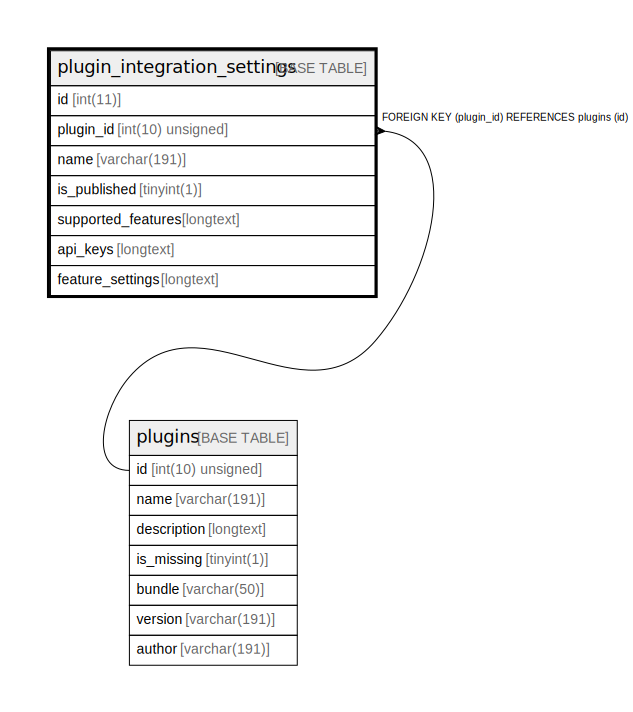

# plugin_integration_settings

## Description

<details>
<summary><strong>Table Definition</strong></summary>

```sql
CREATE TABLE `plugin_integration_settings` (
  `id` int(11) NOT NULL AUTO_INCREMENT,
  `plugin_id` int(10) unsigned DEFAULT NULL,
  `name` varchar(191) COLLATE utf8mb4_unicode_ci NOT NULL,
  `is_published` tinyint(1) NOT NULL,
  `supported_features` longtext COLLATE utf8mb4_unicode_ci DEFAULT NULL COMMENT '(DC2Type:array)',
  `api_keys` longtext COLLATE utf8mb4_unicode_ci NOT NULL COMMENT '(DC2Type:array)',
  `feature_settings` longtext COLLATE utf8mb4_unicode_ci DEFAULT NULL COMMENT '(DC2Type:array)',
  PRIMARY KEY (`id`),
  KEY `IDX_941A2CE0EC942BCF` (`plugin_id`),
  CONSTRAINT `FK_941A2CE0EC942BCF` FOREIGN KEY (`plugin_id`) REFERENCES `plugins` (`id`) ON DELETE CASCADE
) ENGINE=InnoDB AUTO_INCREMENT=[Redacted by tbls] DEFAULT CHARSET=utf8mb4 COLLATE=utf8mb4_unicode_ci ROW_FORMAT=DYNAMIC
```

</details>

## Columns

| Name | Type | Default | Nullable | Extra Definition | Children | Parents | Comment |
| ---- | ---- | ------- | -------- | --------------- | -------- | ------- | ------- |
| id | int(11) |  | false | auto_increment |  |  |  |
| plugin_id | int(10) unsigned | NULL | true |  |  | [plugins](plugins.md) |  |
| name | varchar(191) |  | false |  |  |  |  |
| is_published | tinyint(1) |  | false |  |  |  |  |
| supported_features | longtext | NULL | true |  |  |  | (DC2Type:array) |
| api_keys | longtext |  | false |  |  |  | (DC2Type:array) |
| feature_settings | longtext | NULL | true |  |  |  | (DC2Type:array) |

## Constraints

| Name | Type | Definition |
| ---- | ---- | ---------- |
| FK_941A2CE0EC942BCF | FOREIGN KEY | FOREIGN KEY (plugin_id) REFERENCES plugins (id) |
| PRIMARY | PRIMARY KEY | PRIMARY KEY (id) |

## Indexes

| Name | Definition |
| ---- | ---------- |
| IDX_941A2CE0EC942BCF | KEY IDX_941A2CE0EC942BCF (plugin_id) USING BTREE |
| PRIMARY | PRIMARY KEY (id) USING BTREE |

## Relations



---

> Generated by [tbls](https://github.com/k1LoW/tbls)
