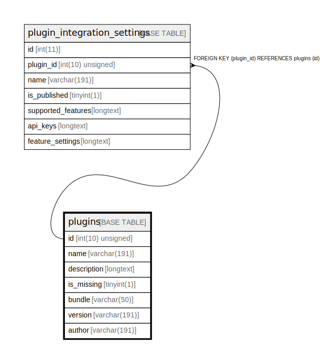

# plugins

## Description

<details>
<summary><strong>Table Definition</strong></summary>

```sql
CREATE TABLE `plugins` (
  `id` int(10) unsigned NOT NULL AUTO_INCREMENT,
  `name` varchar(191) COLLATE utf8mb4_unicode_ci NOT NULL,
  `description` longtext COLLATE utf8mb4_unicode_ci DEFAULT NULL,
  `is_missing` tinyint(1) NOT NULL,
  `bundle` varchar(50) COLLATE utf8mb4_unicode_ci NOT NULL,
  `version` varchar(191) COLLATE utf8mb4_unicode_ci DEFAULT NULL,
  `author` varchar(191) COLLATE utf8mb4_unicode_ci DEFAULT NULL,
  PRIMARY KEY (`id`),
  UNIQUE KEY `unique_bundle` (`bundle`)
) ENGINE=InnoDB AUTO_INCREMENT=[Redacted by tbls] DEFAULT CHARSET=utf8mb4 COLLATE=utf8mb4_unicode_ci ROW_FORMAT=DYNAMIC
```

</details>

## Columns

| Name | Type | Default | Nullable | Extra Definition | Children | Parents | Comment |
| ---- | ---- | ------- | -------- | --------------- | -------- | ------- | ------- |
| id | int(10) unsigned |  | false | auto_increment | [plugin_integration_settings](plugin_integration_settings.md) |  |  |
| name | varchar(191) |  | false |  |  |  |  |
| description | longtext | NULL | true |  |  |  |  |
| is_missing | tinyint(1) |  | false |  |  |  |  |
| bundle | varchar(50) |  | false |  |  |  |  |
| version | varchar(191) | NULL | true |  |  |  |  |
| author | varchar(191) | NULL | true |  |  |  |  |

## Constraints

| Name | Type | Definition |
| ---- | ---- | ---------- |
| PRIMARY | PRIMARY KEY | PRIMARY KEY (id) |
| unique_bundle | UNIQUE | UNIQUE KEY unique_bundle (bundle) |

## Indexes

| Name | Definition |
| ---- | ---------- |
| PRIMARY | PRIMARY KEY (id) USING BTREE |
| unique_bundle | UNIQUE KEY unique_bundle (bundle) USING BTREE |

## Relations



---

> Generated by [tbls](https://github.com/k1LoW/tbls)
