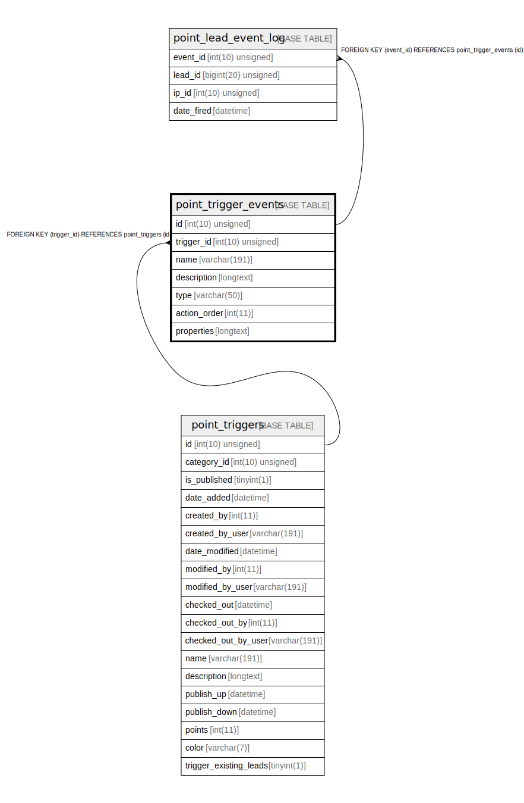

# point_trigger_events

## Description

<details>
<summary><strong>Table Definition</strong></summary>

```sql
CREATE TABLE `point_trigger_events` (
  `id` int(10) unsigned NOT NULL AUTO_INCREMENT,
  `trigger_id` int(10) unsigned NOT NULL,
  `name` varchar(191) COLLATE utf8mb4_unicode_ci NOT NULL,
  `description` longtext COLLATE utf8mb4_unicode_ci DEFAULT NULL,
  `type` varchar(50) COLLATE utf8mb4_unicode_ci NOT NULL,
  `action_order` int(11) NOT NULL,
  `properties` longtext COLLATE utf8mb4_unicode_ci NOT NULL COMMENT '(DC2Type:array)',
  PRIMARY KEY (`id`),
  KEY `IDX_D5669585FDDDCD6` (`trigger_id`),
  KEY `trigger_type_search` (`type`),
  CONSTRAINT `FK_D5669585FDDDCD6` FOREIGN KEY (`trigger_id`) REFERENCES `point_triggers` (`id`) ON DELETE CASCADE
) ENGINE=InnoDB DEFAULT CHARSET=utf8mb4 COLLATE=utf8mb4_unicode_ci ROW_FORMAT=DYNAMIC
```

</details>

## Columns

| Name | Type | Default | Nullable | Extra Definition | Children | Parents | Comment |
| ---- | ---- | ------- | -------- | --------------- | -------- | ------- | ------- |
| id | int(10) unsigned |  | false | auto_increment | [point_lead_event_log](point_lead_event_log.md) |  |  |
| trigger_id | int(10) unsigned |  | false |  |  | [point_triggers](point_triggers.md) |  |
| name | varchar(191) |  | false |  |  |  |  |
| description | longtext | NULL | true |  |  |  |  |
| type | varchar(50) |  | false |  |  |  |  |
| action_order | int(11) |  | false |  |  |  |  |
| properties | longtext |  | false |  |  |  | (DC2Type:array) |

## Constraints

| Name | Type | Definition |
| ---- | ---- | ---------- |
| FK_D5669585FDDDCD6 | FOREIGN KEY | FOREIGN KEY (trigger_id) REFERENCES point_triggers (id) |
| PRIMARY | PRIMARY KEY | PRIMARY KEY (id) |

## Indexes

| Name | Definition |
| ---- | ---------- |
| IDX_D5669585FDDDCD6 | KEY IDX_D5669585FDDDCD6 (trigger_id) USING BTREE |
| trigger_type_search | KEY trigger_type_search (type) USING BTREE |
| PRIMARY | PRIMARY KEY (id) USING BTREE |

## Relations



---

> Generated by [tbls](https://github.com/k1LoW/tbls)
