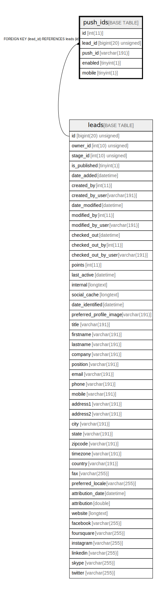

# push_ids

## Description

<details>
<summary><strong>Table Definition</strong></summary>

```sql
CREATE TABLE `push_ids` (
  `id` int(11) NOT NULL AUTO_INCREMENT,
  `lead_id` bigint(20) unsigned DEFAULT NULL,
  `push_id` varchar(191) COLLATE utf8mb4_unicode_ci NOT NULL,
  `enabled` tinyint(1) NOT NULL,
  `mobile` tinyint(1) NOT NULL,
  PRIMARY KEY (`id`),
  KEY `IDX_4F2393E855458D` (`lead_id`),
  CONSTRAINT `FK_4F2393E855458D` FOREIGN KEY (`lead_id`) REFERENCES `leads` (`id`) ON DELETE SET NULL
) ENGINE=InnoDB DEFAULT CHARSET=utf8mb4 COLLATE=utf8mb4_unicode_ci ROW_FORMAT=DYNAMIC
```

</details>

## Columns

| Name | Type | Default | Nullable | Extra Definition | Children | Parents | Comment |
| ---- | ---- | ------- | -------- | --------------- | -------- | ------- | ------- |
| id | int(11) |  | false | auto_increment |  |  |  |
| lead_id | bigint(20) unsigned | NULL | true |  |  | [leads](leads.md) |  |
| push_id | varchar(191) |  | false |  |  |  |  |
| enabled | tinyint(1) |  | false |  |  |  |  |
| mobile | tinyint(1) |  | false |  |  |  |  |

## Constraints

| Name | Type | Definition |
| ---- | ---- | ---------- |
| FK_4F2393E855458D | FOREIGN KEY | FOREIGN KEY (lead_id) REFERENCES leads (id) |
| PRIMARY | PRIMARY KEY | PRIMARY KEY (id) |

## Indexes

| Name | Definition |
| ---- | ---------- |
| IDX_4F2393E855458D | KEY IDX_4F2393E855458D (lead_id) USING BTREE |
| PRIMARY | PRIMARY KEY (id) USING BTREE |

## Relations



---

> Generated by [tbls](https://github.com/k1LoW/tbls)
