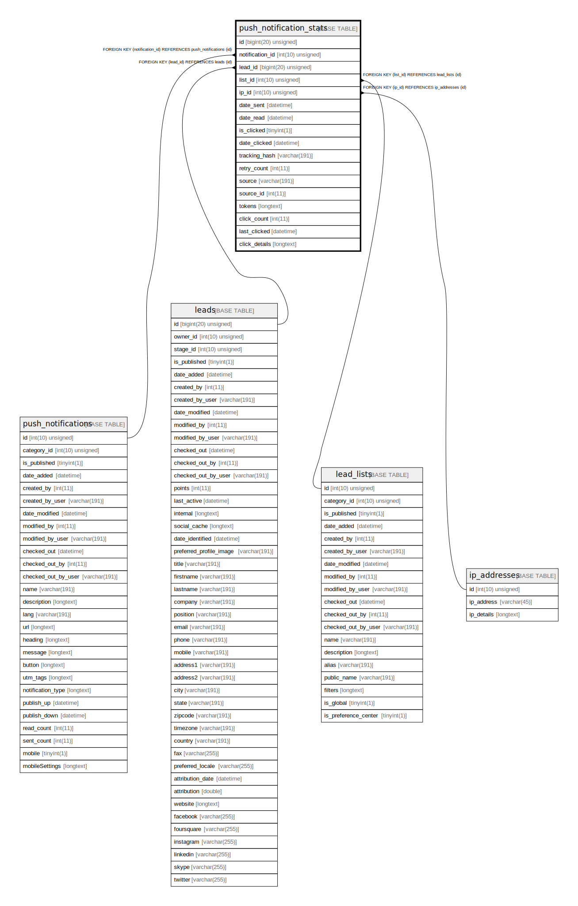

# push_notification_stats

## Description

<details>
<summary><strong>Table Definition</strong></summary>

```sql
CREATE TABLE `push_notification_stats` (
  `id` bigint(20) unsigned NOT NULL AUTO_INCREMENT,
  `notification_id` int(10) unsigned DEFAULT NULL,
  `lead_id` bigint(20) unsigned DEFAULT NULL,
  `list_id` int(10) unsigned DEFAULT NULL,
  `ip_id` int(10) unsigned DEFAULT NULL,
  `date_sent` datetime NOT NULL,
  `date_read` datetime DEFAULT NULL,
  `is_clicked` tinyint(1) NOT NULL,
  `date_clicked` datetime DEFAULT NULL,
  `tracking_hash` varchar(191) COLLATE utf8mb4_unicode_ci DEFAULT NULL,
  `retry_count` int(11) DEFAULT NULL,
  `source` varchar(191) COLLATE utf8mb4_unicode_ci DEFAULT NULL,
  `source_id` int(11) DEFAULT NULL,
  `tokens` longtext COLLATE utf8mb4_unicode_ci DEFAULT NULL COMMENT '(DC2Type:array)',
  `click_count` int(11) DEFAULT NULL,
  `last_clicked` datetime DEFAULT NULL,
  `click_details` longtext COLLATE utf8mb4_unicode_ci DEFAULT NULL COMMENT '(DC2Type:array)',
  PRIMARY KEY (`id`),
  KEY `IDX_DE63695EEF1A9D84` (`notification_id`),
  KEY `IDX_DE63695E55458D` (`lead_id`),
  KEY `IDX_DE63695E3DAE168B` (`list_id`),
  KEY `IDX_DE63695EA03F5E9F` (`ip_id`),
  KEY `stat_notification_search` (`notification_id`,`lead_id`),
  KEY `stat_notification_clicked_search` (`is_clicked`),
  KEY `stat_notification_hash_search` (`tracking_hash`),
  KEY `stat_notification_source_search` (`source`,`source_id`),
  CONSTRAINT `FK_DE63695E3DAE168B` FOREIGN KEY (`list_id`) REFERENCES `lead_lists` (`id`) ON DELETE SET NULL,
  CONSTRAINT `FK_DE63695E55458D` FOREIGN KEY (`lead_id`) REFERENCES `leads` (`id`) ON DELETE SET NULL,
  CONSTRAINT `FK_DE63695EA03F5E9F` FOREIGN KEY (`ip_id`) REFERENCES `ip_addresses` (`id`),
  CONSTRAINT `FK_DE63695EEF1A9D84` FOREIGN KEY (`notification_id`) REFERENCES `push_notifications` (`id`) ON DELETE SET NULL
) ENGINE=InnoDB DEFAULT CHARSET=utf8mb4 COLLATE=utf8mb4_unicode_ci ROW_FORMAT=DYNAMIC
```

</details>

## Columns

| Name | Type | Default | Nullable | Extra Definition | Children | Parents | Comment |
| ---- | ---- | ------- | -------- | --------------- | -------- | ------- | ------- |
| id | bigint(20) unsigned |  | false | auto_increment |  |  |  |
| notification_id | int(10) unsigned | NULL | true |  |  | [push_notifications](push_notifications.md) |  |
| lead_id | bigint(20) unsigned | NULL | true |  |  | [leads](leads.md) |  |
| list_id | int(10) unsigned | NULL | true |  |  | [lead_lists](lead_lists.md) |  |
| ip_id | int(10) unsigned | NULL | true |  |  | [ip_addresses](ip_addresses.md) |  |
| date_sent | datetime |  | false |  |  |  |  |
| date_read | datetime | NULL | true |  |  |  |  |
| is_clicked | tinyint(1) |  | false |  |  |  |  |
| date_clicked | datetime | NULL | true |  |  |  |  |
| tracking_hash | varchar(191) | NULL | true |  |  |  |  |
| retry_count | int(11) | NULL | true |  |  |  |  |
| source | varchar(191) | NULL | true |  |  |  |  |
| source_id | int(11) | NULL | true |  |  |  |  |
| tokens | longtext | NULL | true |  |  |  | (DC2Type:array) |
| click_count | int(11) | NULL | true |  |  |  |  |
| last_clicked | datetime | NULL | true |  |  |  |  |
| click_details | longtext | NULL | true |  |  |  | (DC2Type:array) |

## Constraints

| Name | Type | Definition |
| ---- | ---- | ---------- |
| FK_DE63695E3DAE168B | FOREIGN KEY | FOREIGN KEY (list_id) REFERENCES lead_lists (id) |
| FK_DE63695E55458D | FOREIGN KEY | FOREIGN KEY (lead_id) REFERENCES leads (id) |
| FK_DE63695EA03F5E9F | FOREIGN KEY | FOREIGN KEY (ip_id) REFERENCES ip_addresses (id) |
| FK_DE63695EEF1A9D84 | FOREIGN KEY | FOREIGN KEY (notification_id) REFERENCES push_notifications (id) |
| PRIMARY | PRIMARY KEY | PRIMARY KEY (id) |

## Indexes

| Name | Definition |
| ---- | ---------- |
| IDX_DE63695E3DAE168B | KEY IDX_DE63695E3DAE168B (list_id) USING BTREE |
| IDX_DE63695E55458D | KEY IDX_DE63695E55458D (lead_id) USING BTREE |
| IDX_DE63695EA03F5E9F | KEY IDX_DE63695EA03F5E9F (ip_id) USING BTREE |
| IDX_DE63695EEF1A9D84 | KEY IDX_DE63695EEF1A9D84 (notification_id) USING BTREE |
| stat_notification_clicked_search | KEY stat_notification_clicked_search (is_clicked) USING BTREE |
| stat_notification_hash_search | KEY stat_notification_hash_search (tracking_hash) USING BTREE |
| stat_notification_search | KEY stat_notification_search (notification_id, lead_id) USING BTREE |
| stat_notification_source_search | KEY stat_notification_source_search (source, source_id) USING BTREE |
| PRIMARY | PRIMARY KEY (id) USING BTREE |

## Relations



---

> Generated by [tbls](https://github.com/k1LoW/tbls)
