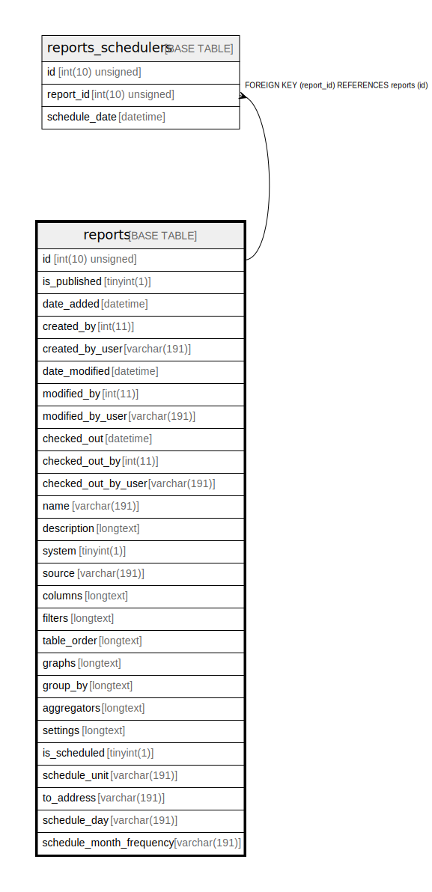

# reports

## Description

<details>
<summary><strong>Table Definition</strong></summary>

```sql
CREATE TABLE `reports` (
  `id` int(10) unsigned NOT NULL AUTO_INCREMENT,
  `is_published` tinyint(1) NOT NULL,
  `date_added` datetime DEFAULT NULL,
  `created_by` int(11) DEFAULT NULL,
  `created_by_user` varchar(191) COLLATE utf8mb4_unicode_ci DEFAULT NULL,
  `date_modified` datetime DEFAULT NULL,
  `modified_by` int(11) DEFAULT NULL,
  `modified_by_user` varchar(191) COLLATE utf8mb4_unicode_ci DEFAULT NULL,
  `checked_out` datetime DEFAULT NULL,
  `checked_out_by` int(11) DEFAULT NULL,
  `checked_out_by_user` varchar(191) COLLATE utf8mb4_unicode_ci DEFAULT NULL,
  `name` varchar(191) COLLATE utf8mb4_unicode_ci NOT NULL,
  `description` longtext COLLATE utf8mb4_unicode_ci DEFAULT NULL,
  `system` tinyint(1) NOT NULL,
  `source` varchar(191) COLLATE utf8mb4_unicode_ci NOT NULL,
  `columns` longtext COLLATE utf8mb4_unicode_ci DEFAULT NULL COMMENT '(DC2Type:array)',
  `filters` longtext COLLATE utf8mb4_unicode_ci DEFAULT NULL COMMENT '(DC2Type:array)',
  `table_order` longtext COLLATE utf8mb4_unicode_ci DEFAULT NULL COMMENT '(DC2Type:array)',
  `graphs` longtext COLLATE utf8mb4_unicode_ci DEFAULT NULL COMMENT '(DC2Type:array)',
  `group_by` longtext COLLATE utf8mb4_unicode_ci DEFAULT NULL COMMENT '(DC2Type:array)',
  `aggregators` longtext COLLATE utf8mb4_unicode_ci DEFAULT NULL COMMENT '(DC2Type:array)',
  `settings` longtext COLLATE utf8mb4_unicode_ci DEFAULT NULL COMMENT '(DC2Type:json_array)',
  `is_scheduled` tinyint(1) NOT NULL,
  `schedule_unit` varchar(191) COLLATE utf8mb4_unicode_ci DEFAULT NULL,
  `to_address` varchar(191) COLLATE utf8mb4_unicode_ci DEFAULT NULL,
  `schedule_day` varchar(191) COLLATE utf8mb4_unicode_ci DEFAULT NULL,
  `schedule_month_frequency` varchar(191) COLLATE utf8mb4_unicode_ci DEFAULT NULL,
  PRIMARY KEY (`id`)
) ENGINE=InnoDB AUTO_INCREMENT=[Redacted by tbls] DEFAULT CHARSET=utf8mb4 COLLATE=utf8mb4_unicode_ci ROW_FORMAT=DYNAMIC
```

</details>

## Columns

| Name | Type | Default | Nullable | Extra Definition | Children | Parents | Comment |
| ---- | ---- | ------- | -------- | --------------- | -------- | ------- | ------- |
| id | int(10) unsigned |  | false | auto_increment | [reports_schedulers](reports_schedulers.md) |  |  |
| is_published | tinyint(1) |  | false |  |  |  |  |
| date_added | datetime | NULL | true |  |  |  |  |
| created_by | int(11) | NULL | true |  |  |  |  |
| created_by_user | varchar(191) | NULL | true |  |  |  |  |
| date_modified | datetime | NULL | true |  |  |  |  |
| modified_by | int(11) | NULL | true |  |  |  |  |
| modified_by_user | varchar(191) | NULL | true |  |  |  |  |
| checked_out | datetime | NULL | true |  |  |  |  |
| checked_out_by | int(11) | NULL | true |  |  |  |  |
| checked_out_by_user | varchar(191) | NULL | true |  |  |  |  |
| name | varchar(191) |  | false |  |  |  |  |
| description | longtext | NULL | true |  |  |  |  |
| system | tinyint(1) |  | false |  |  |  |  |
| source | varchar(191) |  | false |  |  |  |  |
| columns | longtext | NULL | true |  |  |  | (DC2Type:array) |
| filters | longtext | NULL | true |  |  |  | (DC2Type:array) |
| table_order | longtext | NULL | true |  |  |  | (DC2Type:array) |
| graphs | longtext | NULL | true |  |  |  | (DC2Type:array) |
| group_by | longtext | NULL | true |  |  |  | (DC2Type:array) |
| aggregators | longtext | NULL | true |  |  |  | (DC2Type:array) |
| settings | longtext | NULL | true |  |  |  | (DC2Type:json_array) |
| is_scheduled | tinyint(1) |  | false |  |  |  |  |
| schedule_unit | varchar(191) | NULL | true |  |  |  |  |
| to_address | varchar(191) | NULL | true |  |  |  |  |
| schedule_day | varchar(191) | NULL | true |  |  |  |  |
| schedule_month_frequency | varchar(191) | NULL | true |  |  |  |  |

## Constraints

| Name | Type | Definition |
| ---- | ---- | ---------- |
| PRIMARY | PRIMARY KEY | PRIMARY KEY (id) |

## Indexes

| Name | Definition |
| ---- | ---------- |
| PRIMARY | PRIMARY KEY (id) USING BTREE |

## Relations



---

> Generated by [tbls](https://github.com/k1LoW/tbls)
