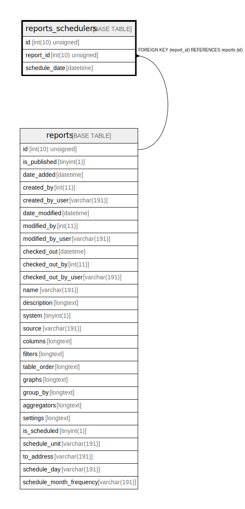

# reports_schedulers

## Description

<details>
<summary><strong>Table Definition</strong></summary>

```sql
CREATE TABLE `reports_schedulers` (
  `id` int(10) unsigned NOT NULL AUTO_INCREMENT,
  `report_id` int(10) unsigned NOT NULL,
  `schedule_date` datetime NOT NULL,
  PRIMARY KEY (`id`),
  KEY `IDX_C74CA6B84BD2A4C0` (`report_id`),
  CONSTRAINT `FK_C74CA6B84BD2A4C0` FOREIGN KEY (`report_id`) REFERENCES `reports` (`id`) ON DELETE CASCADE
) ENGINE=InnoDB DEFAULT CHARSET=utf8mb4 COLLATE=utf8mb4_unicode_ci ROW_FORMAT=DYNAMIC
```

</details>

## Columns

| Name | Type | Default | Nullable | Extra Definition | Children | Parents | Comment |
| ---- | ---- | ------- | -------- | --------------- | -------- | ------- | ------- |
| id | int(10) unsigned |  | false | auto_increment |  |  |  |
| report_id | int(10) unsigned |  | false |  |  | [reports](reports.md) |  |
| schedule_date | datetime |  | false |  |  |  |  |

## Constraints

| Name | Type | Definition |
| ---- | ---- | ---------- |
| FK_C74CA6B84BD2A4C0 | FOREIGN KEY | FOREIGN KEY (report_id) REFERENCES reports (id) |
| PRIMARY | PRIMARY KEY | PRIMARY KEY (id) |

## Indexes

| Name | Definition |
| ---- | ---------- |
| IDX_C74CA6B84BD2A4C0 | KEY IDX_C74CA6B84BD2A4C0 (report_id) USING BTREE |
| PRIMARY | PRIMARY KEY (id) USING BTREE |

## Relations



---

> Generated by [tbls](https://github.com/k1LoW/tbls)
