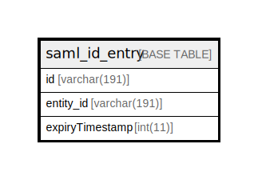

# saml_id_entry

## Description

<details>
<summary><strong>Table Definition</strong></summary>

```sql
CREATE TABLE `saml_id_entry` (
  `id` varchar(191) COLLATE utf8mb4_unicode_ci NOT NULL,
  `entity_id` varchar(191) COLLATE utf8mb4_unicode_ci NOT NULL,
  `expiryTimestamp` int(11) NOT NULL,
  PRIMARY KEY (`id`,`entity_id`)
) ENGINE=InnoDB DEFAULT CHARSET=utf8mb4 COLLATE=utf8mb4_unicode_ci ROW_FORMAT=DYNAMIC
```

</details>

## Columns

| Name | Type | Default | Nullable | Children | Parents | Comment |
| ---- | ---- | ------- | -------- | -------- | ------- | ------- |
| id | varchar(191) |  | false |  |  |  |
| entity_id | varchar(191) |  | false |  |  |  |
| expiryTimestamp | int(11) |  | false |  |  |  |

## Constraints

| Name | Type | Definition |
| ---- | ---- | ---------- |
| PRIMARY | PRIMARY KEY | PRIMARY KEY (id, entity_id) |

## Indexes

| Name | Definition |
| ---- | ---------- |
| PRIMARY | PRIMARY KEY (id, entity_id) USING BTREE |

## Relations



---

> Generated by [tbls](https://github.com/k1LoW/tbls)
