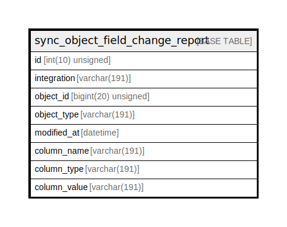

# sync_object_field_change_report

## Description

<details>
<summary><strong>Table Definition</strong></summary>

```sql
CREATE TABLE `sync_object_field_change_report` (
  `id` int(10) unsigned NOT NULL AUTO_INCREMENT,
  `integration` varchar(191) COLLATE utf8mb4_unicode_ci NOT NULL,
  `object_id` bigint(20) unsigned NOT NULL,
  `object_type` varchar(191) COLLATE utf8mb4_unicode_ci NOT NULL,
  `modified_at` datetime NOT NULL,
  `column_name` varchar(191) COLLATE utf8mb4_unicode_ci NOT NULL,
  `column_type` varchar(191) COLLATE utf8mb4_unicode_ci NOT NULL,
  `column_value` varchar(191) COLLATE utf8mb4_unicode_ci NOT NULL,
  PRIMARY KEY (`id`),
  KEY `object_composite_key` (`object_type`,`object_id`,`column_name`),
  KEY `integration_object_composite_key` (`integration`,`object_type`,`object_id`,`column_name`),
  KEY `integration_object_type_modification_composite_key` (`integration`,`object_type`,`modified_at`)
) ENGINE=InnoDB DEFAULT CHARSET=utf8mb4 COLLATE=utf8mb4_unicode_ci ROW_FORMAT=DYNAMIC
```

</details>

## Columns

| Name | Type | Default | Nullable | Extra Definition | Children | Parents | Comment |
| ---- | ---- | ------- | -------- | --------------- | -------- | ------- | ------- |
| id | int(10) unsigned |  | false | auto_increment |  |  |  |
| integration | varchar(191) |  | false |  |  |  |  |
| object_id | bigint(20) unsigned |  | false |  |  |  |  |
| object_type | varchar(191) |  | false |  |  |  |  |
| modified_at | datetime |  | false |  |  |  |  |
| column_name | varchar(191) |  | false |  |  |  |  |
| column_type | varchar(191) |  | false |  |  |  |  |
| column_value | varchar(191) |  | false |  |  |  |  |

## Constraints

| Name | Type | Definition |
| ---- | ---- | ---------- |
| PRIMARY | PRIMARY KEY | PRIMARY KEY (id) |

## Indexes

| Name | Definition |
| ---- | ---------- |
| integration_object_composite_key | KEY integration_object_composite_key (integration, object_type, object_id, column_name) USING BTREE |
| integration_object_type_modification_composite_key | KEY integration_object_type_modification_composite_key (integration, object_type, modified_at) USING BTREE |
| object_composite_key | KEY object_composite_key (object_type, object_id, column_name) USING BTREE |
| PRIMARY | PRIMARY KEY (id) USING BTREE |

## Relations



---

> Generated by [tbls](https://github.com/k1LoW/tbls)
