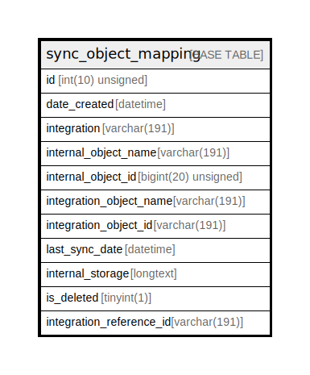

# sync_object_mapping

## Description

<details>
<summary><strong>Table Definition</strong></summary>

```sql
CREATE TABLE `sync_object_mapping` (
  `id` int(10) unsigned NOT NULL AUTO_INCREMENT,
  `date_created` datetime NOT NULL,
  `integration` varchar(191) COLLATE utf8mb4_unicode_ci NOT NULL,
  `internal_object_name` varchar(191) COLLATE utf8mb4_unicode_ci NOT NULL,
  `internal_object_id` bigint(20) unsigned NOT NULL,
  `integration_object_name` varchar(191) COLLATE utf8mb4_unicode_ci NOT NULL,
  `integration_object_id` varchar(191) COLLATE utf8mb4_unicode_ci NOT NULL,
  `last_sync_date` datetime NOT NULL,
  `internal_storage` longtext COLLATE utf8mb4_unicode_ci NOT NULL COMMENT '(DC2Type:json_array)',
  `is_deleted` tinyint(1) NOT NULL,
  `integration_reference_id` varchar(191) COLLATE utf8mb4_unicode_ci DEFAULT NULL,
  PRIMARY KEY (`id`),
  KEY `integration_object` (`integration`,`integration_object_name`,`integration_object_id`,`integration_reference_id`),
  KEY `integration_reference` (`integration`,`integration_object_name`,`integration_reference_id`,`integration_object_id`),
  KEY `integration_last_sync_date` (`integration`,`last_sync_date`)
) ENGINE=InnoDB DEFAULT CHARSET=utf8mb4 COLLATE=utf8mb4_unicode_ci ROW_FORMAT=DYNAMIC
```

</details>

## Columns

| Name | Type | Default | Nullable | Extra Definition | Children | Parents | Comment |
| ---- | ---- | ------- | -------- | --------------- | -------- | ------- | ------- |
| id | int(10) unsigned |  | false | auto_increment |  |  |  |
| date_created | datetime |  | false |  |  |  |  |
| integration | varchar(191) |  | false |  |  |  |  |
| internal_object_name | varchar(191) |  | false |  |  |  |  |
| internal_object_id | bigint(20) unsigned |  | false |  |  |  |  |
| integration_object_name | varchar(191) |  | false |  |  |  |  |
| integration_object_id | varchar(191) |  | false |  |  |  |  |
| last_sync_date | datetime |  | false |  |  |  |  |
| internal_storage | longtext |  | false |  |  |  | (DC2Type:json_array) |
| is_deleted | tinyint(1) |  | false |  |  |  |  |
| integration_reference_id | varchar(191) | NULL | true |  |  |  |  |

## Constraints

| Name | Type | Definition |
| ---- | ---- | ---------- |
| PRIMARY | PRIMARY KEY | PRIMARY KEY (id) |

## Indexes

| Name | Definition |
| ---- | ---------- |
| integration_last_sync_date | KEY integration_last_sync_date (integration, last_sync_date) USING BTREE |
| integration_object | KEY integration_object (integration, integration_object_name, integration_object_id, integration_reference_id) USING BTREE |
| integration_reference | KEY integration_reference (integration, integration_object_name, integration_reference_id, integration_object_id) USING BTREE |
| PRIMARY | PRIMARY KEY (id) USING BTREE |

## Relations



---

> Generated by [tbls](https://github.com/k1LoW/tbls)
