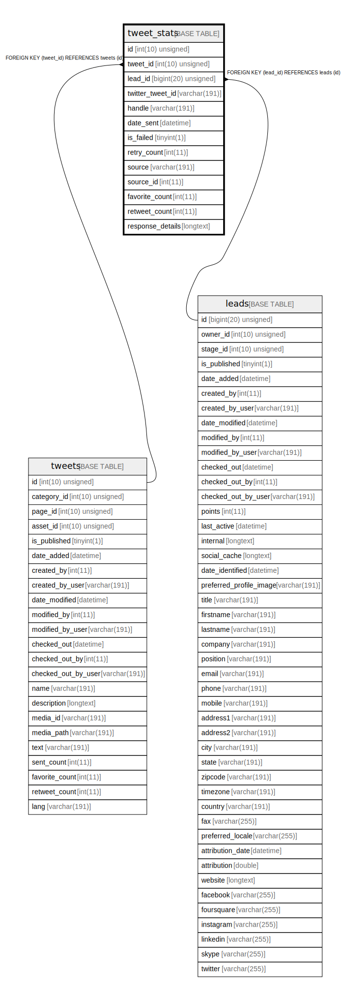

# tweet_stats

## Description

<details>
<summary><strong>Table Definition</strong></summary>

```sql
CREATE TABLE `tweet_stats` (
  `id` int(10) unsigned NOT NULL AUTO_INCREMENT,
  `tweet_id` int(10) unsigned DEFAULT NULL,
  `lead_id` bigint(20) unsigned DEFAULT NULL,
  `twitter_tweet_id` varchar(191) COLLATE utf8mb4_unicode_ci DEFAULT NULL,
  `handle` varchar(191) COLLATE utf8mb4_unicode_ci NOT NULL,
  `date_sent` datetime DEFAULT NULL,
  `is_failed` tinyint(1) DEFAULT NULL,
  `retry_count` int(11) DEFAULT NULL,
  `source` varchar(191) COLLATE utf8mb4_unicode_ci DEFAULT NULL,
  `source_id` int(11) DEFAULT NULL,
  `favorite_count` int(11) DEFAULT NULL,
  `retweet_count` int(11) DEFAULT NULL,
  `response_details` longtext COLLATE utf8mb4_unicode_ci DEFAULT NULL COMMENT '(DC2Type:json_array)',
  PRIMARY KEY (`id`),
  KEY `IDX_CB8CBAE51041E39B` (`tweet_id`),
  KEY `IDX_CB8CBAE555458D` (`lead_id`),
  KEY `stat_tweet_search` (`tweet_id`,`lead_id`),
  KEY `stat_tweet_search2` (`lead_id`,`tweet_id`),
  KEY `stat_tweet_failed_search` (`is_failed`),
  KEY `stat_tweet_source_search` (`source`,`source_id`),
  KEY `favorite_count_index` (`favorite_count`),
  KEY `retweet_count_index` (`retweet_count`),
  KEY `tweet_date_sent` (`date_sent`),
  KEY `twitter_tweet_id_index` (`twitter_tweet_id`),
  CONSTRAINT `FK_CB8CBAE51041E39B` FOREIGN KEY (`tweet_id`) REFERENCES `tweets` (`id`) ON DELETE SET NULL,
  CONSTRAINT `FK_CB8CBAE555458D` FOREIGN KEY (`lead_id`) REFERENCES `leads` (`id`) ON DELETE SET NULL
) ENGINE=InnoDB DEFAULT CHARSET=utf8mb4 COLLATE=utf8mb4_unicode_ci ROW_FORMAT=DYNAMIC
```

</details>

## Columns

| Name | Type | Default | Nullable | Extra Definition | Children | Parents | Comment |
| ---- | ---- | ------- | -------- | --------------- | -------- | ------- | ------- |
| id | int(10) unsigned |  | false | auto_increment |  |  |  |
| tweet_id | int(10) unsigned | NULL | true |  |  | [tweets](tweets.md) |  |
| lead_id | bigint(20) unsigned | NULL | true |  |  | [leads](leads.md) |  |
| twitter_tweet_id | varchar(191) | NULL | true |  |  |  |  |
| handle | varchar(191) |  | false |  |  |  |  |
| date_sent | datetime | NULL | true |  |  |  |  |
| is_failed | tinyint(1) | NULL | true |  |  |  |  |
| retry_count | int(11) | NULL | true |  |  |  |  |
| source | varchar(191) | NULL | true |  |  |  |  |
| source_id | int(11) | NULL | true |  |  |  |  |
| favorite_count | int(11) | NULL | true |  |  |  |  |
| retweet_count | int(11) | NULL | true |  |  |  |  |
| response_details | longtext | NULL | true |  |  |  | (DC2Type:json_array) |

## Constraints

| Name | Type | Definition |
| ---- | ---- | ---------- |
| FK_CB8CBAE51041E39B | FOREIGN KEY | FOREIGN KEY (tweet_id) REFERENCES tweets (id) |
| FK_CB8CBAE555458D | FOREIGN KEY | FOREIGN KEY (lead_id) REFERENCES leads (id) |
| PRIMARY | PRIMARY KEY | PRIMARY KEY (id) |

## Indexes

| Name | Definition |
| ---- | ---------- |
| favorite_count_index | KEY favorite_count_index (favorite_count) USING BTREE |
| IDX_CB8CBAE51041E39B | KEY IDX_CB8CBAE51041E39B (tweet_id) USING BTREE |
| IDX_CB8CBAE555458D | KEY IDX_CB8CBAE555458D (lead_id) USING BTREE |
| retweet_count_index | KEY retweet_count_index (retweet_count) USING BTREE |
| stat_tweet_failed_search | KEY stat_tweet_failed_search (is_failed) USING BTREE |
| stat_tweet_search | KEY stat_tweet_search (tweet_id, lead_id) USING BTREE |
| stat_tweet_search2 | KEY stat_tweet_search2 (lead_id, tweet_id) USING BTREE |
| stat_tweet_source_search | KEY stat_tweet_source_search (source, source_id) USING BTREE |
| tweet_date_sent | KEY tweet_date_sent (date_sent) USING BTREE |
| twitter_tweet_id_index | KEY twitter_tweet_id_index (twitter_tweet_id) USING BTREE |
| PRIMARY | PRIMARY KEY (id) USING BTREE |

## Relations



---

> Generated by [tbls](https://github.com/k1LoW/tbls)
