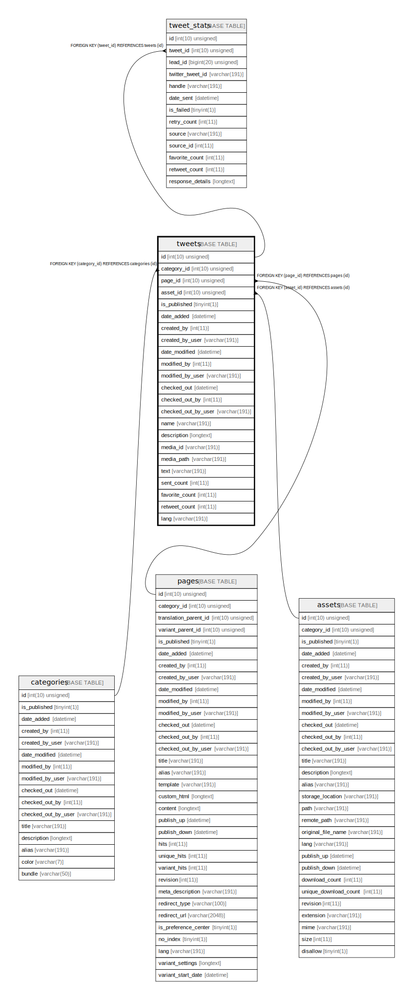

# tweets

## Description

<details>
<summary><strong>Table Definition</strong></summary>

```sql
CREATE TABLE `tweets` (
  `id` int(10) unsigned NOT NULL AUTO_INCREMENT,
  `category_id` int(10) unsigned DEFAULT NULL,
  `page_id` int(10) unsigned DEFAULT NULL,
  `asset_id` int(10) unsigned DEFAULT NULL,
  `is_published` tinyint(1) NOT NULL,
  `date_added` datetime DEFAULT NULL,
  `created_by` int(11) DEFAULT NULL,
  `created_by_user` varchar(191) COLLATE utf8mb4_unicode_ci DEFAULT NULL,
  `date_modified` datetime DEFAULT NULL,
  `modified_by` int(11) DEFAULT NULL,
  `modified_by_user` varchar(191) COLLATE utf8mb4_unicode_ci DEFAULT NULL,
  `checked_out` datetime DEFAULT NULL,
  `checked_out_by` int(11) DEFAULT NULL,
  `checked_out_by_user` varchar(191) COLLATE utf8mb4_unicode_ci DEFAULT NULL,
  `name` varchar(191) COLLATE utf8mb4_unicode_ci NOT NULL,
  `description` longtext COLLATE utf8mb4_unicode_ci DEFAULT NULL,
  `media_id` varchar(191) COLLATE utf8mb4_unicode_ci DEFAULT NULL,
  `media_path` varchar(191) COLLATE utf8mb4_unicode_ci DEFAULT NULL,
  `text` varchar(191) COLLATE utf8mb4_unicode_ci NOT NULL,
  `sent_count` int(11) DEFAULT NULL,
  `favorite_count` int(11) DEFAULT NULL,
  `retweet_count` int(11) DEFAULT NULL,
  `lang` varchar(191) COLLATE utf8mb4_unicode_ci DEFAULT NULL,
  PRIMARY KEY (`id`),
  KEY `IDX_AA38402512469DE2` (`category_id`),
  KEY `IDX_AA384025C4663E4` (`page_id`),
  KEY `IDX_AA3840255DA1941` (`asset_id`),
  KEY `sent_count_index` (`sent_count`),
  KEY `favorite_count_index` (`favorite_count`),
  KEY `retweet_count_index` (`retweet_count`),
  CONSTRAINT `FK_AA38402512469DE2` FOREIGN KEY (`category_id`) REFERENCES `categories` (`id`) ON DELETE SET NULL,
  CONSTRAINT `FK_AA3840255DA1941` FOREIGN KEY (`asset_id`) REFERENCES `assets` (`id`) ON DELETE SET NULL,
  CONSTRAINT `FK_AA384025C4663E4` FOREIGN KEY (`page_id`) REFERENCES `pages` (`id`) ON DELETE SET NULL
) ENGINE=InnoDB DEFAULT CHARSET=utf8mb4 COLLATE=utf8mb4_unicode_ci ROW_FORMAT=DYNAMIC
```

</details>

## Columns

| Name | Type | Default | Nullable | Extra Definition | Children | Parents | Comment |
| ---- | ---- | ------- | -------- | --------------- | -------- | ------- | ------- |
| id | int(10) unsigned |  | false | auto_increment | [tweet_stats](tweet_stats.md) |  |  |
| category_id | int(10) unsigned | NULL | true |  |  | [categories](categories.md) |  |
| page_id | int(10) unsigned | NULL | true |  |  | [pages](pages.md) |  |
| asset_id | int(10) unsigned | NULL | true |  |  | [assets](assets.md) |  |
| is_published | tinyint(1) |  | false |  |  |  |  |
| date_added | datetime | NULL | true |  |  |  |  |
| created_by | int(11) | NULL | true |  |  |  |  |
| created_by_user | varchar(191) | NULL | true |  |  |  |  |
| date_modified | datetime | NULL | true |  |  |  |  |
| modified_by | int(11) | NULL | true |  |  |  |  |
| modified_by_user | varchar(191) | NULL | true |  |  |  |  |
| checked_out | datetime | NULL | true |  |  |  |  |
| checked_out_by | int(11) | NULL | true |  |  |  |  |
| checked_out_by_user | varchar(191) | NULL | true |  |  |  |  |
| name | varchar(191) |  | false |  |  |  |  |
| description | longtext | NULL | true |  |  |  |  |
| media_id | varchar(191) | NULL | true |  |  |  |  |
| media_path | varchar(191) | NULL | true |  |  |  |  |
| text | varchar(191) |  | false |  |  |  |  |
| sent_count | int(11) | NULL | true |  |  |  |  |
| favorite_count | int(11) | NULL | true |  |  |  |  |
| retweet_count | int(11) | NULL | true |  |  |  |  |
| lang | varchar(191) | NULL | true |  |  |  |  |

## Constraints

| Name | Type | Definition |
| ---- | ---- | ---------- |
| FK_AA38402512469DE2 | FOREIGN KEY | FOREIGN KEY (category_id) REFERENCES categories (id) |
| FK_AA3840255DA1941 | FOREIGN KEY | FOREIGN KEY (asset_id) REFERENCES assets (id) |
| FK_AA384025C4663E4 | FOREIGN KEY | FOREIGN KEY (page_id) REFERENCES pages (id) |
| PRIMARY | PRIMARY KEY | PRIMARY KEY (id) |

## Indexes

| Name | Definition |
| ---- | ---------- |
| favorite_count_index | KEY favorite_count_index (favorite_count) USING BTREE |
| IDX_AA38402512469DE2 | KEY IDX_AA38402512469DE2 (category_id) USING BTREE |
| IDX_AA3840255DA1941 | KEY IDX_AA3840255DA1941 (asset_id) USING BTREE |
| IDX_AA384025C4663E4 | KEY IDX_AA384025C4663E4 (page_id) USING BTREE |
| retweet_count_index | KEY retweet_count_index (retweet_count) USING BTREE |
| sent_count_index | KEY sent_count_index (sent_count) USING BTREE |
| PRIMARY | PRIMARY KEY (id) USING BTREE |

## Relations



---

> Generated by [tbls](https://github.com/k1LoW/tbls)
