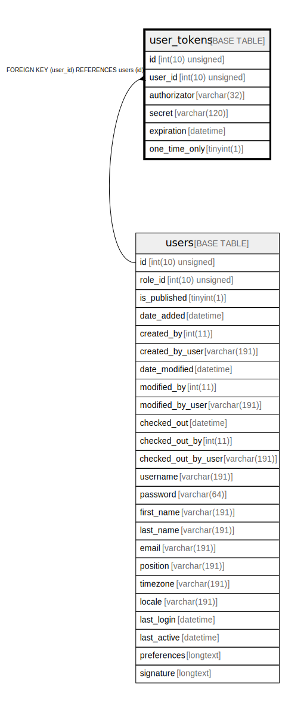

# user_tokens

## Description

<details>
<summary><strong>Table Definition</strong></summary>

```sql
CREATE TABLE `user_tokens` (
  `id` int(10) unsigned NOT NULL AUTO_INCREMENT,
  `user_id` int(10) unsigned NOT NULL,
  `authorizator` varchar(32) COLLATE utf8mb4_unicode_ci NOT NULL,
  `secret` varchar(120) COLLATE utf8mb4_unicode_ci NOT NULL,
  `expiration` datetime DEFAULT NULL,
  `one_time_only` tinyint(1) NOT NULL,
  PRIMARY KEY (`id`),
  UNIQUE KEY `UNIQ_CF080AB35CA2E8E5` (`secret`),
  KEY `IDX_CF080AB3A76ED395` (`user_id`),
  CONSTRAINT `FK_CF080AB3A76ED395` FOREIGN KEY (`user_id`) REFERENCES `users` (`id`) ON DELETE CASCADE
) ENGINE=InnoDB DEFAULT CHARSET=utf8mb4 COLLATE=utf8mb4_unicode_ci ROW_FORMAT=DYNAMIC
```

</details>

## Columns

| Name | Type | Default | Nullable | Extra Definition | Children | Parents | Comment |
| ---- | ---- | ------- | -------- | --------------- | -------- | ------- | ------- |
| id | int(10) unsigned |  | false | auto_increment |  |  |  |
| user_id | int(10) unsigned |  | false |  |  | [users](users.md) |  |
| authorizator | varchar(32) |  | false |  |  |  |  |
| secret | varchar(120) |  | false |  |  |  |  |
| expiration | datetime | NULL | true |  |  |  |  |
| one_time_only | tinyint(1) |  | false |  |  |  |  |

## Constraints

| Name | Type | Definition |
| ---- | ---- | ---------- |
| FK_CF080AB3A76ED395 | FOREIGN KEY | FOREIGN KEY (user_id) REFERENCES users (id) |
| PRIMARY | PRIMARY KEY | PRIMARY KEY (id) |
| UNIQ_CF080AB35CA2E8E5 | UNIQUE | UNIQUE KEY UNIQ_CF080AB35CA2E8E5 (secret) |

## Indexes

| Name | Definition |
| ---- | ---------- |
| IDX_CF080AB3A76ED395 | KEY IDX_CF080AB3A76ED395 (user_id) USING BTREE |
| PRIMARY | PRIMARY KEY (id) USING BTREE |
| UNIQ_CF080AB35CA2E8E5 | UNIQUE KEY UNIQ_CF080AB35CA2E8E5 (secret) USING BTREE |

## Relations



---

> Generated by [tbls](https://github.com/k1LoW/tbls)
