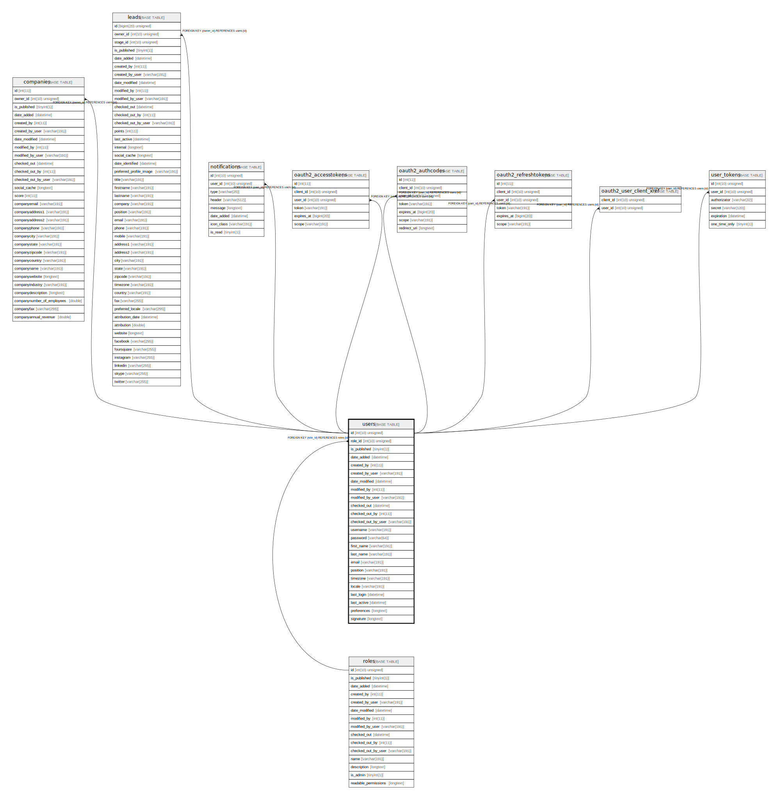

# users

## Description

<details>
<summary><strong>Table Definition</strong></summary>

```sql
CREATE TABLE `users` (
  `id` int(10) unsigned NOT NULL AUTO_INCREMENT,
  `role_id` int(10) unsigned NOT NULL,
  `is_published` tinyint(1) NOT NULL,
  `date_added` datetime DEFAULT NULL,
  `created_by` int(11) DEFAULT NULL,
  `created_by_user` varchar(191) COLLATE utf8mb4_unicode_ci DEFAULT NULL,
  `date_modified` datetime DEFAULT NULL,
  `modified_by` int(11) DEFAULT NULL,
  `modified_by_user` varchar(191) COLLATE utf8mb4_unicode_ci DEFAULT NULL,
  `checked_out` datetime DEFAULT NULL,
  `checked_out_by` int(11) DEFAULT NULL,
  `checked_out_by_user` varchar(191) COLLATE utf8mb4_unicode_ci DEFAULT NULL,
  `username` varchar(191) COLLATE utf8mb4_unicode_ci NOT NULL,
  `password` varchar(64) COLLATE utf8mb4_unicode_ci NOT NULL,
  `first_name` varchar(191) COLLATE utf8mb4_unicode_ci NOT NULL,
  `last_name` varchar(191) COLLATE utf8mb4_unicode_ci NOT NULL,
  `email` varchar(191) COLLATE utf8mb4_unicode_ci NOT NULL,
  `position` varchar(191) COLLATE utf8mb4_unicode_ci DEFAULT NULL,
  `timezone` varchar(191) COLLATE utf8mb4_unicode_ci DEFAULT NULL,
  `locale` varchar(191) COLLATE utf8mb4_unicode_ci DEFAULT NULL,
  `last_login` datetime DEFAULT NULL,
  `last_active` datetime DEFAULT NULL,
  `preferences` longtext COLLATE utf8mb4_unicode_ci DEFAULT NULL COMMENT '(DC2Type:array)',
  `signature` longtext COLLATE utf8mb4_unicode_ci DEFAULT NULL,
  PRIMARY KEY (`id`),
  UNIQUE KEY `UNIQ_1483A5E9F85E0677` (`username`),
  UNIQUE KEY `UNIQ_1483A5E9E7927C74` (`email`),
  KEY `IDX_1483A5E9D60322AC` (`role_id`),
  CONSTRAINT `FK_1483A5E9D60322AC` FOREIGN KEY (`role_id`) REFERENCES `roles` (`id`)
) ENGINE=InnoDB AUTO_INCREMENT=[Redacted by tbls] DEFAULT CHARSET=utf8mb4 COLLATE=utf8mb4_unicode_ci ROW_FORMAT=DYNAMIC
```

</details>

## Columns

| Name | Type | Default | Nullable | Extra Definition | Children | Parents | Comment |
| ---- | ---- | ------- | -------- | --------------- | -------- | ------- | ------- |
| id | int(10) unsigned |  | false | auto_increment | [companies](companies.md) [leads](leads.md) [notifications](notifications.md) [oauth2_accesstokens](oauth2_accesstokens.md) [oauth2_authcodes](oauth2_authcodes.md) [oauth2_refreshtokens](oauth2_refreshtokens.md) [oauth2_user_client_xref](oauth2_user_client_xref.md) [user_tokens](user_tokens.md) |  |  |
| role_id | int(10) unsigned |  | false |  |  | [roles](roles.md) |  |
| is_published | tinyint(1) |  | false |  |  |  |  |
| date_added | datetime | NULL | true |  |  |  |  |
| created_by | int(11) | NULL | true |  |  |  |  |
| created_by_user | varchar(191) | NULL | true |  |  |  |  |
| date_modified | datetime | NULL | true |  |  |  |  |
| modified_by | int(11) | NULL | true |  |  |  |  |
| modified_by_user | varchar(191) | NULL | true |  |  |  |  |
| checked_out | datetime | NULL | true |  |  |  |  |
| checked_out_by | int(11) | NULL | true |  |  |  |  |
| checked_out_by_user | varchar(191) | NULL | true |  |  |  |  |
| username | varchar(191) |  | false |  |  |  |  |
| password | varchar(64) |  | false |  |  |  |  |
| first_name | varchar(191) |  | false |  |  |  |  |
| last_name | varchar(191) |  | false |  |  |  |  |
| email | varchar(191) |  | false |  |  |  |  |
| position | varchar(191) | NULL | true |  |  |  |  |
| timezone | varchar(191) | NULL | true |  |  |  |  |
| locale | varchar(191) | NULL | true |  |  |  |  |
| last_login | datetime | NULL | true |  |  |  |  |
| last_active | datetime | NULL | true |  |  |  |  |
| preferences | longtext | NULL | true |  |  |  | (DC2Type:array) |
| signature | longtext | NULL | true |  |  |  |  |

## Constraints

| Name | Type | Definition |
| ---- | ---- | ---------- |
| FK_1483A5E9D60322AC | FOREIGN KEY | FOREIGN KEY (role_id) REFERENCES roles (id) |
| PRIMARY | PRIMARY KEY | PRIMARY KEY (id) |
| UNIQ_1483A5E9E7927C74 | UNIQUE | UNIQUE KEY UNIQ_1483A5E9E7927C74 (email) |
| UNIQ_1483A5E9F85E0677 | UNIQUE | UNIQUE KEY UNIQ_1483A5E9F85E0677 (username) |

## Indexes

| Name | Definition |
| ---- | ---------- |
| IDX_1483A5E9D60322AC | KEY IDX_1483A5E9D60322AC (role_id) USING BTREE |
| PRIMARY | PRIMARY KEY (id) USING BTREE |
| UNIQ_1483A5E9E7927C74 | UNIQUE KEY UNIQ_1483A5E9E7927C74 (email) USING BTREE |
| UNIQ_1483A5E9F85E0677 | UNIQUE KEY UNIQ_1483A5E9F85E0677 (username) USING BTREE |

## Relations



---

> Generated by [tbls](https://github.com/k1LoW/tbls)
