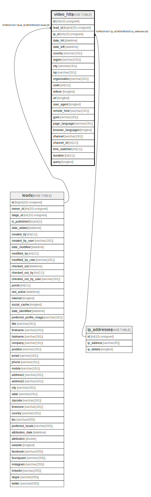

# video_hits

## Description

<details>
<summary><strong>Table Definition</strong></summary>

```sql
CREATE TABLE `video_hits` (
  `id` int(10) unsigned NOT NULL AUTO_INCREMENT,
  `lead_id` bigint(20) unsigned DEFAULT NULL,
  `ip_id` int(10) unsigned NOT NULL,
  `date_hit` datetime NOT NULL,
  `date_left` datetime DEFAULT NULL,
  `country` varchar(191) COLLATE utf8mb4_unicode_ci DEFAULT NULL,
  `region` varchar(191) COLLATE utf8mb4_unicode_ci DEFAULT NULL,
  `city` varchar(191) COLLATE utf8mb4_unicode_ci DEFAULT NULL,
  `isp` varchar(191) COLLATE utf8mb4_unicode_ci DEFAULT NULL,
  `organization` varchar(191) COLLATE utf8mb4_unicode_ci DEFAULT NULL,
  `code` int(11) NOT NULL,
  `referer` longtext COLLATE utf8mb4_unicode_ci DEFAULT NULL,
  `url` longtext COLLATE utf8mb4_unicode_ci DEFAULT NULL,
  `user_agent` longtext COLLATE utf8mb4_unicode_ci DEFAULT NULL,
  `remote_host` varchar(191) COLLATE utf8mb4_unicode_ci DEFAULT NULL,
  `guid` varchar(191) COLLATE utf8mb4_unicode_ci NOT NULL,
  `page_language` varchar(191) COLLATE utf8mb4_unicode_ci DEFAULT NULL,
  `browser_languages` longtext COLLATE utf8mb4_unicode_ci DEFAULT NULL COMMENT '(DC2Type:array)',
  `channel` varchar(191) COLLATE utf8mb4_unicode_ci DEFAULT NULL,
  `channel_id` int(11) DEFAULT NULL,
  `time_watched` int(11) DEFAULT NULL,
  `duration` int(11) DEFAULT NULL,
  `query` longtext COLLATE utf8mb4_unicode_ci DEFAULT NULL COMMENT '(DC2Type:array)',
  PRIMARY KEY (`id`),
  KEY `IDX_1D1831F755458D` (`lead_id`),
  KEY `IDX_1D1831F7A03F5E9F` (`ip_id`),
  KEY `video_date_hit` (`date_hit`),
  KEY `video_channel_search` (`channel`,`channel_id`),
  KEY `video_guid_lead_search` (`guid`,`lead_id`),
  CONSTRAINT `FK_1D1831F755458D` FOREIGN KEY (`lead_id`) REFERENCES `leads` (`id`) ON DELETE SET NULL,
  CONSTRAINT `FK_1D1831F7A03F5E9F` FOREIGN KEY (`ip_id`) REFERENCES `ip_addresses` (`id`)
) ENGINE=InnoDB DEFAULT CHARSET=utf8mb4 COLLATE=utf8mb4_unicode_ci ROW_FORMAT=DYNAMIC
```

</details>

## Columns

| Name | Type | Default | Nullable | Extra Definition | Children | Parents | Comment |
| ---- | ---- | ------- | -------- | --------------- | -------- | ------- | ------- |
| id | int(10) unsigned |  | false | auto_increment |  |  |  |
| lead_id | bigint(20) unsigned | NULL | true |  |  | [leads](leads.md) |  |
| ip_id | int(10) unsigned |  | false |  |  | [ip_addresses](ip_addresses.md) |  |
| date_hit | datetime |  | false |  |  |  |  |
| date_left | datetime | NULL | true |  |  |  |  |
| country | varchar(191) | NULL | true |  |  |  |  |
| region | varchar(191) | NULL | true |  |  |  |  |
| city | varchar(191) | NULL | true |  |  |  |  |
| isp | varchar(191) | NULL | true |  |  |  |  |
| organization | varchar(191) | NULL | true |  |  |  |  |
| code | int(11) |  | false |  |  |  |  |
| referer | longtext | NULL | true |  |  |  |  |
| url | longtext | NULL | true |  |  |  |  |
| user_agent | longtext | NULL | true |  |  |  |  |
| remote_host | varchar(191) | NULL | true |  |  |  |  |
| guid | varchar(191) |  | false |  |  |  |  |
| page_language | varchar(191) | NULL | true |  |  |  |  |
| browser_languages | longtext | NULL | true |  |  |  | (DC2Type:array) |
| channel | varchar(191) | NULL | true |  |  |  |  |
| channel_id | int(11) | NULL | true |  |  |  |  |
| time_watched | int(11) | NULL | true |  |  |  |  |
| duration | int(11) | NULL | true |  |  |  |  |
| query | longtext | NULL | true |  |  |  | (DC2Type:array) |

## Constraints

| Name | Type | Definition |
| ---- | ---- | ---------- |
| FK_1D1831F755458D | FOREIGN KEY | FOREIGN KEY (lead_id) REFERENCES leads (id) |
| FK_1D1831F7A03F5E9F | FOREIGN KEY | FOREIGN KEY (ip_id) REFERENCES ip_addresses (id) |
| PRIMARY | PRIMARY KEY | PRIMARY KEY (id) |

## Indexes

| Name | Definition |
| ---- | ---------- |
| IDX_1D1831F755458D | KEY IDX_1D1831F755458D (lead_id) USING BTREE |
| IDX_1D1831F7A03F5E9F | KEY IDX_1D1831F7A03F5E9F (ip_id) USING BTREE |
| video_channel_search | KEY video_channel_search (channel, channel_id) USING BTREE |
| video_date_hit | KEY video_date_hit (date_hit) USING BTREE |
| video_guid_lead_search | KEY video_guid_lead_search (guid, lead_id) USING BTREE |
| PRIMARY | PRIMARY KEY (id) USING BTREE |

## Relations



---

> Generated by [tbls](https://github.com/k1LoW/tbls)
