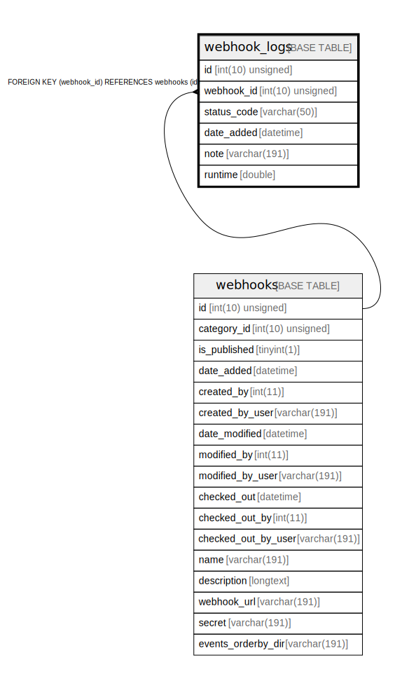

# webhook_logs

## Description

<details>
<summary><strong>Table Definition</strong></summary>

```sql
CREATE TABLE `webhook_logs` (
  `id` int(10) unsigned NOT NULL AUTO_INCREMENT,
  `webhook_id` int(10) unsigned NOT NULL,
  `status_code` varchar(50) COLLATE utf8mb4_unicode_ci NOT NULL,
  `date_added` datetime DEFAULT NULL,
  `note` varchar(191) COLLATE utf8mb4_unicode_ci DEFAULT NULL,
  `runtime` double DEFAULT NULL,
  PRIMARY KEY (`id`),
  KEY `IDX_45A353475C9BA60B` (`webhook_id`),
  CONSTRAINT `FK_45A353475C9BA60B` FOREIGN KEY (`webhook_id`) REFERENCES `webhooks` (`id`) ON DELETE CASCADE
) ENGINE=InnoDB DEFAULT CHARSET=utf8mb4 COLLATE=utf8mb4_unicode_ci ROW_FORMAT=DYNAMIC
```

</details>

## Columns

| Name | Type | Default | Nullable | Extra Definition | Children | Parents | Comment |
| ---- | ---- | ------- | -------- | --------------- | -------- | ------- | ------- |
| id | int(10) unsigned |  | false | auto_increment |  |  |  |
| webhook_id | int(10) unsigned |  | false |  |  | [webhooks](webhooks.md) |  |
| status_code | varchar(50) |  | false |  |  |  |  |
| date_added | datetime | NULL | true |  |  |  |  |
| note | varchar(191) | NULL | true |  |  |  |  |
| runtime | double | NULL | true |  |  |  |  |

## Constraints

| Name | Type | Definition |
| ---- | ---- | ---------- |
| FK_45A353475C9BA60B | FOREIGN KEY | FOREIGN KEY (webhook_id) REFERENCES webhooks (id) |
| PRIMARY | PRIMARY KEY | PRIMARY KEY (id) |

## Indexes

| Name | Definition |
| ---- | ---------- |
| IDX_45A353475C9BA60B | KEY IDX_45A353475C9BA60B (webhook_id) USING BTREE |
| PRIMARY | PRIMARY KEY (id) USING BTREE |

## Relations



---

> Generated by [tbls](https://github.com/k1LoW/tbls)
