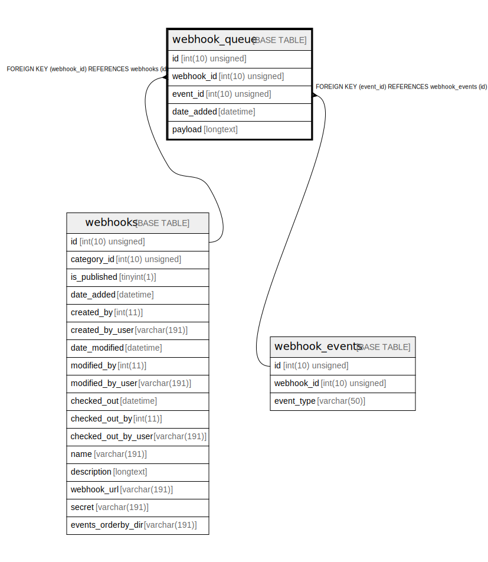

# webhook_queue

## Description

<details>
<summary><strong>Table Definition</strong></summary>

```sql
CREATE TABLE `webhook_queue` (
  `id` int(10) unsigned NOT NULL AUTO_INCREMENT,
  `webhook_id` int(10) unsigned NOT NULL,
  `event_id` int(10) unsigned NOT NULL,
  `date_added` datetime DEFAULT NULL,
  `payload` longtext COLLATE utf8mb4_unicode_ci NOT NULL,
  PRIMARY KEY (`id`),
  KEY `IDX_F52D9A1A5C9BA60B` (`webhook_id`),
  KEY `IDX_F52D9A1A71F7E88B` (`event_id`),
  CONSTRAINT `FK_F52D9A1A5C9BA60B` FOREIGN KEY (`webhook_id`) REFERENCES `webhooks` (`id`) ON DELETE CASCADE,
  CONSTRAINT `FK_F52D9A1A71F7E88B` FOREIGN KEY (`event_id`) REFERENCES `webhook_events` (`id`) ON DELETE CASCADE
) ENGINE=InnoDB DEFAULT CHARSET=utf8mb4 COLLATE=utf8mb4_unicode_ci ROW_FORMAT=DYNAMIC
```

</details>

## Columns

| Name | Type | Default | Nullable | Extra Definition | Children | Parents | Comment |
| ---- | ---- | ------- | -------- | --------------- | -------- | ------- | ------- |
| id | int(10) unsigned |  | false | auto_increment |  |  |  |
| webhook_id | int(10) unsigned |  | false |  |  | [webhooks](webhooks.md) |  |
| event_id | int(10) unsigned |  | false |  |  | [webhook_events](webhook_events.md) |  |
| date_added | datetime | NULL | true |  |  |  |  |
| payload | longtext |  | false |  |  |  |  |

## Constraints

| Name | Type | Definition |
| ---- | ---- | ---------- |
| FK_F52D9A1A5C9BA60B | FOREIGN KEY | FOREIGN KEY (webhook_id) REFERENCES webhooks (id) |
| FK_F52D9A1A71F7E88B | FOREIGN KEY | FOREIGN KEY (event_id) REFERENCES webhook_events (id) |
| PRIMARY | PRIMARY KEY | PRIMARY KEY (id) |

## Indexes

| Name | Definition |
| ---- | ---------- |
| IDX_F52D9A1A5C9BA60B | KEY IDX_F52D9A1A5C9BA60B (webhook_id) USING BTREE |
| IDX_F52D9A1A71F7E88B | KEY IDX_F52D9A1A71F7E88B (event_id) USING BTREE |
| PRIMARY | PRIMARY KEY (id) USING BTREE |

## Relations



---

> Generated by [tbls](https://github.com/k1LoW/tbls)
